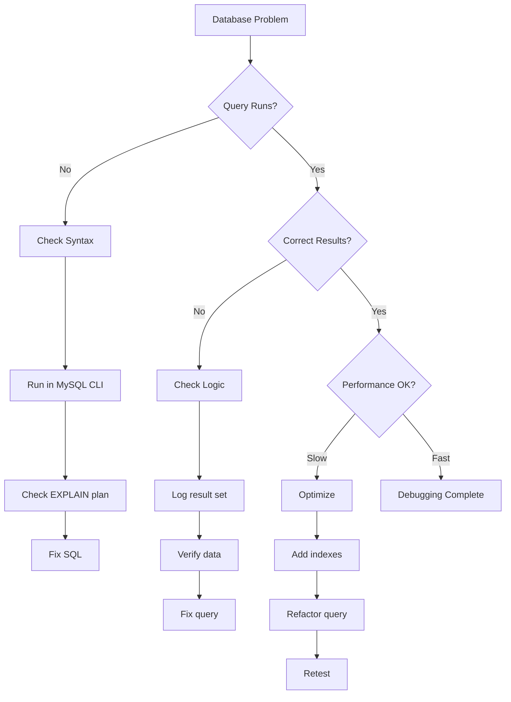
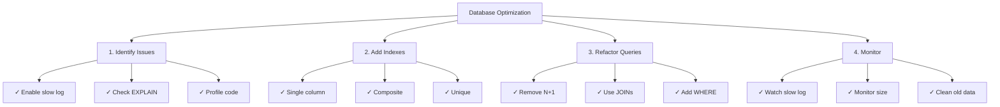

# Database Debugging Techniques

> Methods and tools for debugging SQL queries and database issues in XOOPS applications.

---

## Diagnostic Flowchart



---

## Enable Query Logging

### Method 1: XOOPS Debug Mode

```php
<?php
// In mainfile.php
define('XOOPS_DEBUG_LEVEL', 2);

// Now all queries appear in xoops_log table
// Or in files: xoops_data/logs/
?>
```

Check results:
```bash
# View logs
tail -100 xoops_data/logs/*.log

# Or query database
SELECT * FROM xoops_log ORDER BY created DESC LIMIT 20;
```

---

### Method 2: MySQL Slow Query Log

Enable in `/etc/mysql/my.cnf`:

```ini
[mysqld]
# Enable slow query logging
slow_query_log = 1
slow_query_log_file = /var/log/mysql/slow.log
long_query_time = 1          # Log queries > 1 second
log_queries_not_using_indexes = 1
```

Restart MySQL:
```bash
sudo systemctl restart mysql
# or
sudo systemctl restart mariadb
```

View log:
```bash
tail -100 /var/log/mysql/slow.log

# Or analyze with mysqldumpslow
mysqldumpslow -s t -t 10 /var/log/mysql/slow.log
```

---

### Method 3: General Query Log

Enable for all queries (careful: large log files):

```sql
-- Enable
SET GLOBAL general_log = 'ON';
SET GLOBAL log_output = 'FILE';
SET GLOBAL general_log_file = '/var/log/mysql/general.log';

-- Disable
SET GLOBAL general_log = 'OFF';

-- View
SHOW VARIABLES LIKE 'general_log%';
```

---

## Debug SQL in Code

### Log Query Execution

```php
<?php
require_once 'mainfile.php';

$ray = ray();  // If using Ray debugger

// Execute query
$query = "SELECT u.uid, u.uname, COUNT(a.id) as total_articles
          FROM xoops_users u
          LEFT JOIN xoops_articles a ON u.uid = a.author_id
          GROUP BY u.uid
          ORDER BY total_articles DESC";

$ray->label('Query')->info($query);

$result = $GLOBALS['xoopsDB']->query($query);

if (!$result) {
    $ray->error("SQL Error: " . $GLOBALS['xoopsDB']->error);
    exit;
}

// Log results
$data = [];
while ($row = $result->fetch_assoc()) {
    $data[] = $row;
}

$ray->label('Results')->dump($data);
$ray->info("Found " . count($data) . " rows");
?>
```

---

### Measure Query Performance

```php
<?php
$db = $GLOBALS['xoopsDB'];
$ray = ray();

// Measure execution time
$start = microtime(true);

$query = "SELECT * FROM xoops_articles LIMIT 1000";
$result = $db->query($query);

$exec_time = (microtime(true) - $start) * 1000;  // milliseconds

$ray->info("Query executed in: {$exec_time}ms");

// Log slow queries
if ($exec_time > 100) {  // Alert if > 100ms
    $ray->warning("Slow query detected: {$exec_time}ms");
    $ray->info($query);
}
?>
```

---

### Verify Query Results

```php
<?php
$db = $GLOBALS['xoopsDB'];
$ray = ray();

$query = "SELECT * FROM xoops_articles WHERE author_id = 5";
$result = $db->query($query);

// Check if query succeeded
if (!$result) {
    $ray->error("Query failed: " . $db->error);
    exit;
}

// Get row count
$count = $result->num_rows;
$ray->info("Query returned: $count rows");

// Fetch results
$articles = [];
while ($row = $result->fetch_assoc()) {
    $articles[] = $row;
}

// Verify data
if (empty($articles)) {
    $ray->warning("No articles found for author 5");
} else {
    $ray->success("Found " . count($articles) . " articles");
    $ray->dump($articles);
}
?>
```

---

## Analyze Query Performance

### EXPLAIN Command

Use EXPLAIN to analyze query execution:

```sql
-- Analyze a query
EXPLAIN SELECT * FROM xoops_articles WHERE author_id = 5;

-- With extended information
EXPLAIN EXTENDED SELECT * FROM xoops_articles WHERE author_id = 5;

-- JSON format (shows more details)
EXPLAIN FORMAT=JSON SELECT * FROM xoops_articles WHERE author_id = 5\G
```

**Key Fields to Check:**

```
type: ALL           (bad) - Full table scan
      INDEX         (ok) - Index scan
      ref/const     (good) - Direct index lookup
      range         (ok) - Range scan using index

possible_keys:      Indexes available
key:                Index actually used
key_len:            Length of index used
rows:               Estimated rows examined
Extra:              Additional info (Using where, Using index, etc.)
```

### Example Analysis

```sql
-- Slow query without index
EXPLAIN SELECT * FROM xoops_articles WHERE author_id = 5;

+----+-------------+----------+------+---------------+------+---------+------+-------+-------------+
| id | select_type | table    | type | possible_keys | key  | key_len | rows | Extra |
+----+-------------+----------+------+---------------+------+---------+------+-------+-------------+
|  1 | SIMPLE      | articles | ALL  | NULL          | NULL | NULL    | 1000 | Using where |
+----+-------------+----------+------+---------------+------+-------+------+-------+-------------+
                                      ↑
                          No index available!

-- After adding index
ALTER TABLE xoops_articles ADD INDEX (author_id);

EXPLAIN SELECT * FROM xoops_articles WHERE author_id = 5;

+----+-------------+----------+------+---------------+-----------+---------+-------+------+
| id | select_type | table    | type | possible_keys | key       | key_len | rows  | Extra|
+----+-------------+----------+------+---------------+-----------+---------+-------+------+
|  1 | SIMPLE      | articles | ref  | author_id     | author_id | 4       | 10    |
+----+-------------+----------+------+---------------+-----------+---------+-------+------+
                                                              ↑
                                      Using index - much faster!
```

---

## Common SQL Issues

### 1. N+1 Query Problem

**Problem:**
```php
<?php
// WRONG: Multiple queries in loop
$authors = $db->query("SELECT uid FROM xoops_users LIMIT 100");
while ($author = $authors->fetch_assoc()) {
    // This executes 100 times!
    $articles = $db->query(
        "SELECT COUNT(*) FROM xoops_articles WHERE author_id = " . $author['uid']
    );
    echo $articles->fetch_row()[0];
}
?>
```

**Solution: Use JOIN**
```php
<?php
// CORRECT: One query
$result = $db->query("
    SELECT u.uid, u.uname, COUNT(a.id) as total
    FROM xoops_users u
    LEFT JOIN xoops_articles a ON u.uid = a.author_id
    GROUP BY u.uid
    LIMIT 100
");

while ($row = $result->fetch_assoc()) {
    echo $row['total'];
}
?>
```

---

### 2. Missing Indexes

**Identify:**
```sql
-- Find queries that scan all rows
SELECT * FROM xoops_log
WHERE info LIKE '%type: ALL%'
ORDER BY created DESC;
```

**Add Indexes:**
```sql
-- Single column index
ALTER TABLE xoops_articles ADD INDEX (author_id);
ALTER TABLE xoops_articles ADD INDEX (created);

-- Composite index
ALTER TABLE xoops_articles ADD INDEX (author_id, created);

-- Unique index
ALTER TABLE xoops_articles ADD UNIQUE INDEX (slug);
```

---

### 3. Inefficient WHERE Conditions

**Problem:**
```sql
-- Wrong: Functions prevent index use
SELECT * FROM xoops_articles
WHERE YEAR(created) = 2024;

-- Wrong: OR with different columns
SELECT * FROM xoops_articles
WHERE category = 'tech' OR author_id = 5;
```

**Solution:**
```sql
-- Correct: Use range
SELECT * FROM xoops_articles
WHERE created >= '2024-01-01' AND created < '2025-01-01';

-- Correct: Use UNION for different columns
SELECT * FROM xoops_articles WHERE category = 'tech'
UNION
SELECT * FROM xoops_articles WHERE author_id = 5;
```

---

## Debugging Specific Issues

### Issue: Query Returns Wrong Results

```php
<?php
$ray = ray();

// Test with sample data
$author_id = 5;
$ray->info("Searching for author_id = $author_id");

$query = "SELECT * FROM xoops_articles WHERE author_id = ?";
$stmt = $db->prepare($query);
$stmt->bind_param("i", $author_id);
$stmt->execute();

$result = $stmt->get_result();
$count = $result->num_rows;

$ray->info("Found: $count articles");

// Check if parameterized query helps
if ($count == 0) {
    // Try without parameter to debug
    $debug_query = "SELECT * FROM xoops_articles WHERE author_id = $author_id";
    $ray->warning("Debug query: $debug_query");
}

// Dump first result
if ($row = $result->fetch_assoc()) {
    $ray->label('First Result')->dump($row);
}
?>
```

---

### Issue: Slow Join Query

```php
<?php
$ray = ray();

$query = "
    SELECT a.id, a.title, u.uname, u.email
    FROM xoops_articles a
    LEFT JOIN xoops_users u ON a.author_id = u.uid
    WHERE a.status = 1
    ORDER BY a.created DESC
    LIMIT 50
";

$ray->info("Running join query");
$ray->measure(function() use ($query) {
    $result = $GLOBALS['xoopsDB']->query($query);
    return $result;
});

// Analyze with EXPLAIN
$ray->label('Query Analysis')->info($query);
?>
```

Run EXPLAIN:
```sql
EXPLAIN SELECT a.id, a.title, u.uname, u.email
FROM xoops_articles a
LEFT JOIN xoops_users u ON a.author_id = u.uid
WHERE a.status = 1
ORDER BY a.created DESC
LIMIT 50\G

-- Look for:
-- - type: ALL (need index)
-- - Extra: Using temporary; Using filesort (inefficient)
-- Fix: Add composite index
ALTER TABLE xoops_articles ADD INDEX (status, created);
```

---

## Create Debug Query Log

```php
<?php
// Create modules/yourmodule/QueryLogger.php

class QueryLogger {
    private static $queries = [];
    private static $times = [];

    public static function log($query) {
        self::$queries[] = $query;
        self::$times[] = microtime(true);
    }

    public static function execute($query) {
        $start = microtime(true);
        $result = $GLOBALS['xoopsDB']->query($query);
        $time = (microtime(true) - $start) * 1000;

        self::log($query);
        self::$times[count(self::$times) - 1] = $time;

        return $result;
    }

    public static function report() {
        echo "<h1>Query Report</h1>";
        echo "<table>";
        echo "<tr><th>Query</th><th>Time (ms)</th></tr>";

        foreach (self::$queries as $i => $query) {
            $time = self::$times[$i] ?? 0;
            echo "<tr>";
            echo "<td><pre>" . htmlspecialchars(substr($query, 0, 100)) . "</pre></td>";
            echo "<td>" . number_format($time, 2) . "</td>";
            echo "</tr>";
        }

        echo "</table>";
    }

    public static function getTotalQueries() {
        return count(self::$queries);
    }

    public static function getTotalTime() {
        return array_sum(self::$times);
    }
}
?>
```

Usage:
```php
<?php
require_once 'QueryLogger.php';

$result = QueryLogger::execute("SELECT * FROM xoops_articles");

// Later...
echo "Total queries: " . QueryLogger::getTotalQueries();
echo "Total time: " . QueryLogger::getTotalTime() . "ms";
QueryLogger::report();
?>
```

---

## Database Optimization Checklist



---

## Useful MySQL Queries

```sql
-- Find slow tables
SELECT * FROM xoops_log
WHERE info LIKE '%type: ALL%'
ORDER BY created DESC LIMIT 20;

-- List all indexes
SHOW INDEX FROM xoops_articles;

-- Find duplicate indexes
SELECT a.table_name, a.index_name, a.seq_in_index, a.column_name
FROM information_schema.statistics a
JOIN information_schema.statistics b
  ON a.table_name = b.table_name
  AND a.seq_in_index = b.seq_in_index
  AND a.column_name = b.column_name
  AND a.index_name != b.index_name
WHERE a.table_name LIKE 'xoops_%';

-- Table sizes
SELECT table_name,
       ROUND(((data_length + index_length) / 1024 / 1024), 2) AS size_mb
FROM information_schema.tables
WHERE table_schema = 'xoops_db'
ORDER BY size_mb DESC;

-- Find unused indexes
SELECT * FROM performance_schema.table_io_waits_summary_by_index_usage
WHERE object_schema != 'mysql'
AND count_star = 0
ORDER BY object_name;
```

---

## Related Documentation

- [[Enable-Debug-Mode|Enable Debug Mode]]
- [[Using-Ray-Debugger|Using Ray Debugger]]
- [[../FAQ/Performance-FAQ|Performance FAQ]]
- [[../../02-Core-Concepts/Database/Database-Layer|Database Fundamentals]]

---

#xoops #database #debugging #sql #optimization #mysql
