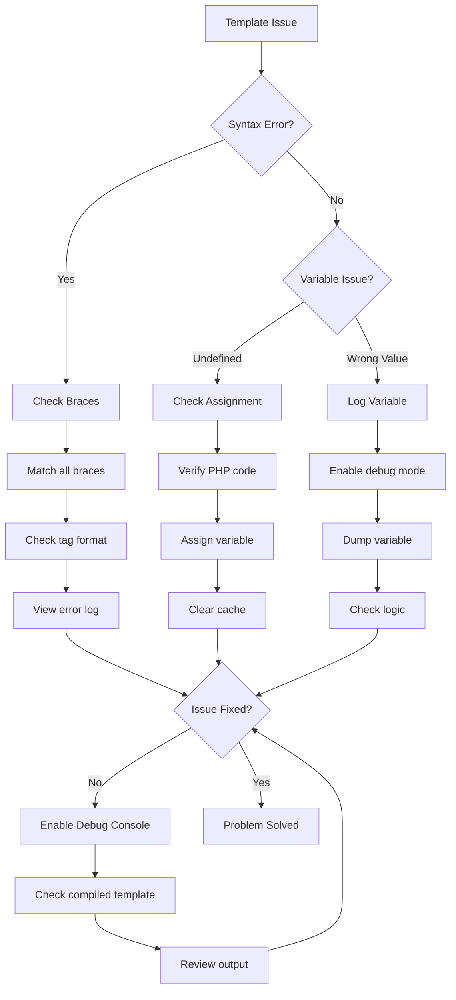
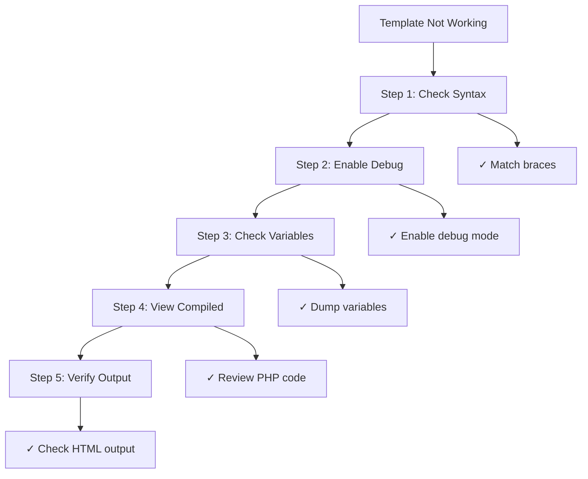

# Smarty Template Debugging

> Advanced techniques for debugging Smarty templates in XOOPS themes and modules.

---

## Diagnostic Flowchart



---

## Enable Smarty Debug Mode

### Method 1: Admin Panel

XOOPS Admin > Settings > Performance:
- Enable "Debug Output"
- Set "Debug Level" to 2

---

### Method 2: Code Configuration

```php
<?php
// In mainfile.php or module code
require_once XOOPS_ROOT_PATH . '/class/smarty/Smarty.class.php';

$tpl = new XoopsTpl();

// Enable debug mode
$tpl->debugging = true;

// Optional: Set custom debug template
$tpl->debug_tpl = XOOPS_ROOT_PATH . '/class/smarty/debug.tpl';

// Render template
$tpl->display('file:template.html');
?>
```

---

### Method 3: Debug Popup in Browser

```smarty
{* Add to template to enable debug in footer *}
{debug}
```

This shows a popup with all assigned variables.

---

## Common Smarty Debug Techniques

### Dump All Variables

```php
<?php
// In PHP code
$tpl = new XoopsTpl();

// Get all assigned variables
$variables = $tpl->get_template_vars();

echo "<pre>";
print_r($variables);
echo "</pre>";
?>
```

In template:
```smarty
{* Display debug info *}
<div style="border: 1px red solid; background: #ffffcc; padding: 10px;">
    <h3>Debug Info</h3>
    {debug}
</div>
```

---

### Log Specific Variable

```php
<?php
$tpl = new XoopsTpl();

// Check if variable exists
$user = $tpl->get_template_var('user');

if ($user === null) {
    error_log("Variable 'user' not assigned to template");
} else {
    error_log("User data: " . json_encode($user));
}
?>
```

---

### Check Variable in Template

```smarty
{* Dump variable for debugging *}
<pre>
{$variable|print_r}
</pre>

{* Or with label *}
<pre>
User Data:
{$user|print_r}
</pre>

{* Check if variable exists *}
{if isset($user)}
    <p>User: {$user.name}</p>
{else}
    <p style="color: red;">ERROR: user variable not set</p>
{/if}
```

---

## View Compiled Templates

Smarty compiles templates to PHP for performance. Debug by viewing compiled code:

```bash
# Find compiled templates
ls -la xoops_data/caches/smarty_compile/

# View compiled template
cat xoops_data/caches/smarty_compile/filename.php
```

```php
<?php
// Create debug script to view latest compiled template
$compile_dir = XOOPS_CACHE_PATH . '/smarty_compile';

// Get latest compiled file
$files = glob($compile_dir . '/*.php');
usort($files, function($a, $b) {
    return filemtime($b) - filemtime($a);
});

if ($files) {
    echo "<h1>Latest Compiled Template</h1>";
    echo "<pre>";
    echo htmlspecialchars(file_get_contents($files[0]));
    echo "</pre>";
}
?>
```

---

## Analyze Template Compilation

```php
<?php
// Create modules/yourmodule/debug_smarty.php

require_once '../../mainfile.php';
require_once XOOPS_ROOT_PATH . '/vendor/autoload.php';

$tpl = new XoopsTpl();
$ray = ray();  // If using Ray debugger

$ray->group('Smarty Configuration');

// Get Smarty paths
$ray->label('Compile Dir')->info($tpl->getCompileDir());
$ray->label('Cache Dir')->info($tpl->getCacheDir());
$ray->label('Template Dirs')->dump($tpl->getTemplateDir());

// Check compiled templates
$compile_dir = $tpl->getCompileDir();
$compiled_files = glob($compile_dir . '*.php');
$ray->label('Compiled Templates')->info(count($compiled_files) . " files");

// Show compilation stats
$total_size = 0;
foreach ($compiled_files as $file) {
    $total_size += filesize($file);
}
$ray->label('Compiled Cache Size')->info(round($total_size / 1024 / 1024, 2) . " MB");

// Check cache directory
$cache_dir = $tpl->getCacheDir();
$cache_files = glob($cache_dir . '*.php');
$ray->label('Cached Templates')->info(count($cache_files) . " files");

$ray->groupEnd();
?>
```

---

## Debug Specific Issues

### Issue 1: Variable Shows as Empty

```php
<?php
$tpl = new XoopsTpl();

// Check what's assigned
$user = $tpl->get_template_var('user');

if ($user === null) {
    error_log("ERROR: 'user' not assigned");
} elseif (empty($user)) {
    error_log("WARNING: 'user' is empty");
} else {
    error_log("user data: " . json_encode($user));
}

// Also check in template
?>
```

Template debug:
```smarty
{if !isset($user)}
    <span style="color: red;">ERROR: user variable not set</span>
{elseif empty($user)}
    <span style="color: orange;">WARNING: user is empty</span>
{else}
    <p>User: {$user.name}</p>
{/if}
```

---

### Issue 2: Array Key Not Found

```smarty
{* Use safe array access *}

{* WRONG - causes undefined index notice *}
{$array.key}

{* CORRECT - check first *}
{if isset($array.key)}
    {$array.key}
{else}
    <span style="color: red;">Key 'key' not found in array</span>
{/if}

{* Or use default *}
{$array.key|default:'key not found'}
```

Debug in PHP:
```php
<?php
$array = $tpl->get_template_var('array');

if (!isset($array['key'])) {
    error_log("Missing key in array: " . json_encode(array_keys($array)));
}
?>
```

---

### Issue 3: Plugin/Modifier Not Found

```php
<?php
// Create custom modifier: plugins/modifier.debug.php

function smarty_modifier_debug($var) {
    return '<pre style="background: #ffffcc; border: 1px solid red;">' .
           htmlspecialchars(json_encode($var, JSON_PRETTY_PRINT)) .
           '</pre>';
}
?>
```

Register in code:
```php
<?php
$tpl = new XoopsTpl();
$tpl->addPluginDir(XOOPS_ROOT_PATH . '/modules/yourmodule/plugins');
$tpl->register_modifier('debug', 'smarty_modifier_debug');
?>
```

Use in template:
```smarty
{$data|debug}
```

---

### Issue 4: Nested Array Display

```smarty
{* Debug nested arrays *}
<div style="background: #f5f5f5; padding: 10px; border: 1px solid #ccc;">
    <h3>Data Debug</h3>
    <pre>{$data|@json_encode}</pre>
</div>

{* Or iterate and show *}
<h3>User Data:</h3>
{foreach $user as $key => $value}
    <p><strong>{$key}:</strong> {$value|escape}</p>
{/foreach}

{* Check for specific keys *}
<h3>Verification:</h3>
<ul>
    <li>Has 'name': {if isset($user.name)}✓{else}✗{/if}</li>
    <li>Has 'email': {if isset($user.email)}✓{else}✗{/if}</li>
    <li>Has 'id': {if isset($user.id)}✓{else}✗{/if}</li>
</ul>
```

---

## Create Debug Template

```smarty
{* Create themes/mytheme/debug.html *}
{strip}

<div style="background: #fff3cd; border: 2px solid #ff0000; padding: 20px; margin: 20px 0;">
    <h2 style="color: #ff0000;">🔍 SMARTY DEBUG MODE</h2>

    <h3>Assigned Variables:</h3>
    <div style="background: white; padding: 10px; border: 1px solid #999; overflow-x: auto; max-height: 400px;">
        {* Show all variables *}
        {debug output='html'}
    </div>

    <h3>Template Information:</h3>
    <table style="width: 100%; border-collapse: collapse;">
        <tr>
            <td style="border: 1px solid #999; padding: 5px;"><strong>Current Template:</strong></td>
            <td style="border: 1px solid #999; padding: 5px;">{$smarty.template}</td>
        </tr>
        <tr>
            <td style="border: 1px solid #999; padding: 5px;"><strong>Smarty Version:</strong></td>
            <td style="border: 1px solid #999; padding: 5px;">{$smarty.version}</td>
        </tr>
        <tr>
            <td style="border: 1px solid #999; padding: 5px;"><strong>Current Time:</strong></td>
            <td style="border: 1px solid #999; padding: 5px;">{$smarty.now|date_format:"%Y-%m-%d %H:%M:%S"}</td>
        </tr>
    </table>

    <p style="color: #ff0000;"><strong>⚠️ Remove this debug code before going to production!</strong></p>
</div>

{/strip}
```

---

## Performance Debugging

### Measure Template Rendering

```php
<?php
$start = microtime(true);

$tpl->display('file:template.html');

$render_time = (microtime(true) - $start) * 1000;

error_log("Template rendered in: {$render_time}ms");

if ($render_time > 100) {
    error_log("WARNING: Slow template rendering");
}
?>
```

### Check Cache Effectiveness

```php
<?php
$compile_dir = XOOPS_CACHE_PATH . '/smarty_compile';
$cache_dir = XOOPS_CACHE_PATH . '/smarty_cache';

// Count files
$compiled = count(glob($compile_dir . '*.php'));
$cached = count(glob($cache_dir . '*.php'));

// Size
$compile_size = 0;
foreach (glob($compile_dir . '*') as $file) {
    $compile_size += filesize($file);
}

$cache_size = 0;
foreach (glob($cache_dir . '*') as $file) {
    $cache_size += filesize($file);
}

echo "Compiled: $compiled files (" . round($compile_size/1024/1024, 2) . "MB)";
echo "Cached: $cached files (" . round($cache_size/1024/1024, 2) . "MB)";

// Age of files
$oldest_compile = min(array_map('filemtime', glob($compile_dir . '*')));
$oldest_cache = min(array_map('filemtime', glob($cache_dir . '*')));

echo "Oldest compiled: " . date('Y-m-d H:i:s', $oldest_compile);
echo "Oldest cached: " . date('Y-m-d H:i:s', $oldest_cache);
?>
```

---

## Clear and Rebuild Cache

```php
<?php
// Force rebuild of all templates

$tpl = new XoopsTpl();

// Clear cache
$tpl->clearCache();
$tpl->clearCompiledTemplate();

// Force recompilation
$tpl->force_compile = true;

// Render all module templates
$modules = ['mymodule', 'publisher', 'downloads'];

foreach ($modules as $module) {
    $template = "file:" . XOOPS_ROOT_PATH . "/modules/$module/templates/index.html";

    try {
        $tpl->display($template);
        error_log("Compiled: $module");
    } catch (Exception $e) {
        error_log("Error compiling $module: " . $e->getMessage());
    }
}

// Disable force compile after done
$tpl->force_compile = false;
?>
```

---

## Debugging Workflow

### Step-by-Step Debug Process



---

## Debug Helper Functions

```php
<?php
// Create class/TemplateDebugger.php

class TemplateDebugger {
    private static $tpl = null;
    private static $debug_info = [];

    public static function init(&$smarty) {
        self::$tpl = $smarty;
    }

    public static function dumpVar($name) {
        $var = self::$tpl->get_template_var($name);

        if ($var === null) {
            self::$debug_info[] = "Variable '$name' not found";
            return;
        }

        self::$debug_info[] = "$name: " . json_encode($var);
    }

    public static function checkVar($name, $keys = []) {
        $var = self::$tpl->get_template_var($name);

        if ($var === null) {
            return "ERROR: Variable '$name' not assigned";
        }

        if (!is_array($var)) {
            return "$name is not an array";
        }

        $missing = [];
        foreach ($keys as $key) {
            if (!isset($var[$key])) {
                $missing[] = $key;
            }
        }

        if ($missing) {
            return "Missing keys in '$name': " . implode(', ', $missing);
        }

        return "OK: Variable '$name' has all required keys";
    }

    public static function getReport() {
        return implode("\n", self::$debug_info);
    }

    public static function logAll() {
        $vars = self::$tpl->get_template_vars();
        error_log("Template Variables: " . json_encode($vars));
    }
}
?>
```

Usage:
```php
<?php
TemplateDebugger::init($tpl);
TemplateDebugger::dumpVar('user');
TemplateDebugger::checkVar('articles', ['id', 'title', 'author']);
error_log(TemplateDebugger::getReport());
?>
```

---

## Related Documentation

- [[Enable-Debug-Mode|Enable Debug Mode]]
- [[../Common-Issues/Template-Errors|Template Errors]]
- [[Using-Ray-Debugger|Using Ray Debugger]]
- [[../../02-Core-Concepts/Templates/Smarty-Templating|Smarty Templating]]

---

#xoops #templates #smarty #debugging #troubleshooting
