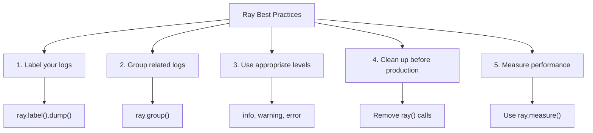

# Using Ray Debugger for XOOPS

> Modern debugging with Ray: inspect variables, log messages, track SQL queries, and profile performance in your XOOPS application.

---

## What is Ray?

Ray is a lightweight debugging tool that helps you inspect application state without stopping execution or using breakpoints. It's perfect for XOOPS development.

**Features:**
- Log messages and variables
- Inspect SQL queries
- Track performance
- Profile code
- Group related logs
- Visual timeline

**Requirements:**
- PHP 8.2+
- Ray application (free version available)
- Composer

---

## Installation

### Step 1: Install Ray Package

```bash
cd /path/to/xoops

# Install Ray via Composer
composer require spatie/ray

# Or install globally
composer global require spatie/ray
```

### Step 2: Download Ray App

Download from [ray.so](https://ray.so):
- Mac: Ray.app
- Windows: Ray.exe
- Linux: ray (AppImage)

### Step 3: Configure Firewall (if needed)

Ray uses port 23517 by default:

```bash
# UFW
sudo ufw allow 23517/udp

# iptables
sudo iptables -A INPUT -p udp --dport 23517 -j ACCEPT
```

---

## Basic Usage

### Simple Logging

```php
<?php
require_once 'mainfile.php';
require 'vendor/autoload.php';

// Initialize Ray
$ray = ray();

// Log a simple message
$ray->info('Page loaded');

// Log a variable
$user = ['name' => 'John', 'email' => 'john@example.com'];
$ray->dump($user);

// Log with label
$ray->label('User Data')->dump($user);
?>
```

**Output in Ray app:**
```
ℹ Page loaded
👁 User Data: ['name' => 'John', 'email' => 'john@example.com']
```

---

### Different Log Levels

```php
<?php
$ray = ray();

// Info
$ray->info('Informational message');

// Success
$ray->success('Operation completed');

// Warning
$ray->warning('Potential issue');

// Error
$ray->error('An error occurred');

// Debug
$ray->debug('Debug information');

// Notice
$ray->notice('Notice message');
?>
```

---

### Dumping Variables

```php
<?php
$ray = ray();

// Simple dump
$ray->dump($variable);

// Multiple dumps
$ray->dump($var1, $var2, $var3);

// With labels
$ray->label('User')->dump($user);
$ray->label('Post')->dump($post);

// Dump array with formatting
$config = [
    'debug' => true,
    'cache' => 'redis',
    'db_host' => 'localhost'
];
$ray->label('Configuration')->dump($config);
?>
```

---

## Advanced Features

### 1. SQL Query Tracking

```php
<?php
$ray = ray();

// Log database query
$ray->notice('Running query');
$result = $GLOBALS['xoopsDB']->query("SELECT * FROM xoops_users LIMIT 10");

// Log result
while ($row = $result->fetch_assoc()) {
    $ray->dump($row);
}

// Or log with label
$query = "SELECT COUNT(*) as total FROM xoops_articles";
$ray->label('Article Count Query')->info($query);
$result = $GLOBALS['xoopsDB']->query($query);
?>
```

### 2. Performance Profiling

```php
<?php
$ray = ray();

// Start a profile
$ray->showQueries();  // Show all queries

// Your code
$start = microtime(true);
expensive_operation();
$end = microtime(true);

$ray->label('Execution Time')->info(($end - $start) . ' seconds');

// Or measure directly
$ray->measure(function() {
    expensive_operation();
});
?>
```

### 3. Conditional Debugging

```php
<?php
$ray = ray();

// Only in development
if (defined('XOOPS_DEBUG_LEVEL') && XOOPS_DEBUG_LEVEL > 0) {
    $ray->debug('Debug mode enabled');
}

// Only for specific user
if ($xoopsUser && $xoopsUser->getVar('uid') == 1) {
    $ray->dump($sensitive_data);
}

// Only in specific section
if ($_GET['debug'] == 'module') {
    $ray->label('Module Debug')->dump($_GET);
}
?>
```

### 4. Grouping Related Logs

```php
<?php
$ray = ray();

// Start a group
$ray->group('User Authentication');
    $ray->info('Checking credentials');
    $ray->info('Password verified');
    $ray->success('User authenticated');
$ray->groupEnd();

// Or use closure
$ray->group('Database Operations', function($ray) {
    $ray->info('Connecting to database');
    $ray->info('Running queries');
    $ray->success('Operations complete');
});
?>
```

---

## XOOPS-Specific Debugging

### Module Debugging

```php
<?php
// modules/mymodule/index.php
require_once '../../mainfile.php';
require_once XOOPS_ROOT_PATH . '/vendor/autoload.php';

$ray = ray();

// Log module initialization
$ray->group('Module Initialization');
    $ray->info('Module: ' . XOOPS_MODULE_NAME);

    // Check module is active
    if (is_object($xoopsModule)) {
        $ray->success('Module loaded');
        $ray->dump($xoopsModule->getValues());
    }

    // Check user permissions
    if (xoops_isUser()) {
        $ray->info('User: ' . $xoopsUser->getVar('uname'));
    } else {
        $ray->warning('Anonymous user');
    }
$ray->groupEnd();

// Get module config
$config_handler = xoops_getHandler('config');
$module = xoops_getHandler('module')->getByDirname(XOOPS_MODULE_NAME);
$settings = $config_handler->getConfigsByCat(0, $module->mid());

$ray->label('Module Settings')->dump($settings);
?>
```

### Template Debugging

```php
<?php
// In template or PHP code
$ray = ray();

// Log assigned variables
$tpl = new XoopsTpl();
$ray->label('Template Variables')->dump($tpl->get_template_vars());

// Log specific variables
$ray->label('User Variable')->dump($tpl->get_template_vars('user'));

// Log Smarty engine state
$ray->label('Smarty Config')->dump([
    'compile_dir' => $tpl->getCompileDir(),
    'cache_dir' => $tpl->getCacheDir(),
    'debugging' => $tpl->debugging
]);
?>
```

### Database Debugging

```php
<?php
$ray = ray();

// Log database operations
$ray->group('Database Operations');

// Count queries
$ray->info('Database Prefix: ' . XOOPS_DB_PREFIX);

// List tables
$result = $GLOBALS['xoopsDB']->query("SHOW TABLES");
$tables = [];
while ($row = $result->fetch_row()) {
    $tables[] = $row[0];
}
$ray->label('Tables')->dump($tables);

// Check connection
if ($GLOBALS['xoopsDB']) {
    $ray->success('Database connected');
} else {
    $ray->error('Database connection failed');
}

$ray->groupEnd();
?>
```

---

## Custom Ray Functions

### Create Helper Functions

```php
<?php
// Create file: class/rayhelper.php

class RayHelper {
    public static function init() {
        return ray();
    }

    public static function module($module_name) {
        $ray = ray();
        $module = xoops_getHandler('module')->getByDirname($module_name);

        if (!$module) {
            $ray->error("Module '$module_name' not found");
            return;
        }

        $ray->group("Module: $module_name");
        $ray->dump([
            'name' => $module->getVar('name'),
            'version' => $module->getVar('version'),
            'active' => $module->getVar('isactive'),
            'mid' => $module->getVar('mid')
        ]);
        $ray->groupEnd();
    }

    public static function user() {
        global $xoopsUser;
        $ray = ray();

        if (!$xoopsUser) {
            $ray->info('Anonymous user');
            return;
        }

        $ray->group('User Information');
        $ray->dump([
            'uname' => $xoopsUser->getVar('uname'),
            'uid' => $xoopsUser->getVar('uid'),
            'email' => $xoopsUser->getVar('email'),
            'admin' => $xoopsUser->isAdmin()
        ]);
        $ray->groupEnd();
    }

    public static function config($module_name) {
        $ray = ray();

        $module = xoops_getHandler('module')->getByDirname($module_name);
        if (!$module) {
            $ray->error("Module '$module_name' not found");
            return;
        }

        $config_handler = xoops_getHandler('config');
        $settings = $config_handler->getConfigsByCat(0, $module->mid());

        $ray->label("$module_name Configuration")->dump($settings);
    }
}
?>
```

Usage:
```php
<?php
require 'class/rayhelper.php';

RayHelper::user();
RayHelper::module('mymodule');
RayHelper::config('mymodule');
?>
```

---

## Performance Monitoring

### Query Performance

```php
<?php
$ray = ray();

// Measure query time
$ray->group('Query Performance');

$queries = [
    "SELECT COUNT(*) FROM xoops_users",
    "SELECT * FROM xoops_articles LIMIT 1000",
    "SELECT a.*, u.uname FROM xoops_articles a JOIN xoops_users u"
];

foreach ($queries as $query) {
    $start = microtime(true);
    $result = $GLOBALS['xoopsDB']->query($query);
    $time = (microtime(true) - $start) * 1000;  // ms

    $ray->label(substr($query, 0, 40) . '...')->info("{$time}ms");
}

$ray->groupEnd();
?>
```

### Request Performance

```php
<?php
$ray = ray();

// Measure total request time
$ray->group('Request Metrics');

// Memory usage
$memory = memory_get_usage() / 1024 / 1024;
$peak = memory_get_peak_usage() / 1024 / 1024;
$ray->info("Memory: {$memory}MB / Peak: {$peak}MB");

// Check execution time
if (function_exists('microtime')) {
    $elapsed = isset($_SERVER['REQUEST_TIME_FLOAT'])
        ? microtime(true) - $_SERVER['REQUEST_TIME_FLOAT']
        : 0;
    $ray->info("Execution time: {$elapsed}s");
}

// File inclusion count
if (function_exists('get_included_files')) {
    $files = count(get_included_files());
    $ray->info("Files included: $files");
}

$ray->groupEnd();
?>
```

---

## Debugging Workflows

### Module Installation Debugging

```php
<?php
// Create modules/mymodule/debug_install.php
require_once '../../mainfile.php';
require_once XOOPS_ROOT_PATH . '/vendor/autoload.php';

$ray = ray();

$ray->group('Module Installation Debug');

// Check xoopsversion.php
$version_file = __DIR__ . '/xoopsversion.php';
if (file_exists($version_file)) {
    $modversion = [];
    include $version_file;
    $ray->label('xoopsversion.php')->dump($modversion);
} else {
    $ray->error('xoopsversion.php not found');
}

// Check language files
$lang_files = glob(__DIR__ . '/language/*/');
$ray->label('Language files')->info("Found " . count($lang_files) . " language(s)");

// Check database tables
$module = xoops_getHandler('module')->getByDirname(basename(__DIR__));
if ($module) {
    $ray->label('Module ID')->info($module->mid());
} else {
    $ray->warning('Module not in database');
}

$ray->groupEnd();

echo "Debug information sent to Ray";
?>
```

### Template Error Debugging

```php
<?php
// Check template rendering
$ray = ray();

$tpl = new XoopsTpl();

$ray->group('Template Debug');

// Log variables
$vars = $tpl->get_template_vars();
$ray->label('Available Variables')->dump(array_keys($vars));

// Check template exists
$template = 'file:templates/page.html';
$ray->info("Template: $template");

// Check compilation
$compile_dir = $tpl->getCompileDir();
$files = glob($compile_dir . '*.php');
$ray->label('Compiled Templates')->info(count($files) . " compiled templates");

$ray->groupEnd();
?>
```

---

## Best Practices



### Cleanup Script

```php
<?php
// Remove Ray from production
// Create script to strip Ray calls

function remove_ray_calls($file) {
    $content = file_get_contents($file);

    // Remove ray() calls
    $content = preg_replace('/\$ray\s*=\s*ray\(\);/', '', $content);
    $content = preg_replace('/\$?ray\->[a-zA-Z_][a-zA-Z0-9_]*\([^)]*\);?/', '', $content);
    $content = preg_replace('/ray\(\)->[a-zA-Z_][a-zA-Z0-9_]*\([^)]*\);?/', '', $content);

    file_put_contents($file, $content);
}

// Find all PHP files with ray() and remove
$files = glob('modules/**/*.php', GLOB_RECURSIVE);
foreach ($files as $file) {
    if (strpos(file_get_contents($file), 'ray()') !== false) {
        remove_ray_calls($file);
        echo "Cleaned: $file\n";
    }
}
?>
```

---

## Troubleshooting Ray

### Q: Ray doesn't receive messages

**A:**
1. Check Ray app is running
2. Check firewall allows port 23517
3. Verify Ray is installed:
```bash
composer require spatie/ray
```

### Q: Can't see SQL queries

**A:**
```php
<?php
// Log queries manually
$ray = ray();

$query = "SELECT * FROM xoops_users";
$ray->info("Query: $query");

$result = $GLOBALS['xoopsDB']->query($query);

if (!$result) {
    $ray->error($GLOBALS['xoopsDB']->error);
}
?>
```

### Q: Performance impact of Ray

**A:** Ray has minimal overhead. For production, remove Ray calls or disable:
```php
<?php
// Disable Ray in production
if (defined('ENVIRONMENT') && ENVIRONMENT == 'production') {
    function ray(...$args) {
        return new class {
            public function __call($name, $args) { return $this; }
        };
    }
}
?>
```

---

## Related Documentation

- [[Enable-Debug-Mode|Enable Debug Mode]]
- [[Database-Debugging|Database Debugging]]
- [[../FAQ/Performance-FAQ|Performance FAQ]]
- [[../../08-Troubleshooting/Troubleshooting|Troubleshooting Guide]]

---

#xoops #debugging #ray #profiling #monitoring
