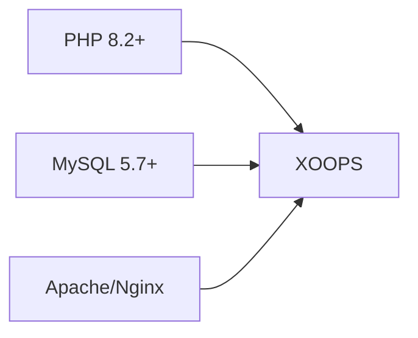
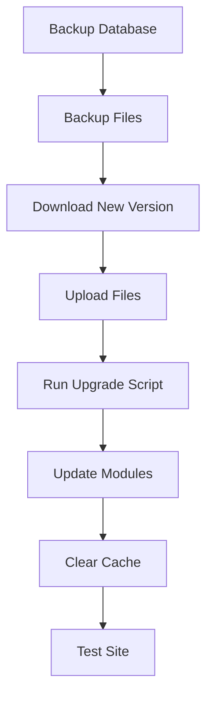

# Installation FAQ

> Common questions and answers about installing XOOPS.

---

## Pre-Installation

### Q: What are the minimum server requirements?

**A:** XOOPS 2.5.x requires:
- PHP 8.2 or higher
- MySQL 5.7+ or MariaDB 10.3+
- Apache with mod_rewrite or Nginx
- At least 64MB PHP memory limit (128MB+ recommended)



### Q: Can I install XOOPS on shared hosting?

**A:** Yes, XOOPS works well on most shared hosting that meets the requirements. Check that your host provides:
- PHP with required extensions (mysqli, gd, curl, json, mbstring)
- MySQL database access
- File upload capability
- .htaccess support (for Apache)

### Q: Which PHP extensions are required?

**A:** Required extensions:
- `mysqli` - Database connectivity
- `gd` - Image processing
- `json` - JSON handling
- `mbstring` - Multibyte string support

Recommended:
- `curl` - External API calls
- `zip` - Module installation
- `intl` - Internationalization

---

## Installation Process

### Q: The installation wizard shows a blank page

**A:** This is usually a PHP error. Try:

1. Enable error display temporarily:
```php
// Add to htdocs/install/index.php at the top
error_reporting(E_ALL);
ini_set('display_errors', 1);
```

2. Check PHP error log
3. Verify PHP version compatibility
4. Ensure all required extensions are loaded

### Q: I get "Cannot write to mainfile.php"

**A:** Set write permissions before installation:

```bash
chmod 666 mainfile.php
# After installation, secure it:
chmod 444 mainfile.php
```

### Q: Database tables are not being created

**A:** Check:

1. MySQL user has CREATE TABLE privileges:
```sql
GRANT ALL PRIVILEGES ON xoopsdb.* TO 'xoopsuser'@'localhost';
FLUSH PRIVILEGES;
```

2. Database exists:
```sql
CREATE DATABASE xoopsdb CHARACTER SET utf8mb4 COLLATE utf8mb4_unicode_ci;
```

3. Credentials in wizard match database settings

### Q: Installation completes but site shows errors

**A:** Common post-installation fixes:

1. Remove or rename install directory:
```bash
mv htdocs/install htdocs/install.bak
```

2. Set proper permissions:
```bash
chmod -R 755 htdocs/
chmod -R 777 xoops_data/
chmod 444 mainfile.php
```

3. Clear cache:
```bash
rm -rf xoops_data/caches/smarty_cache/*
rm -rf xoops_data/caches/smarty_compile/*
```

---

## Configuration

### Q: Where is the configuration file?

**A:** Main configuration is in `mainfile.php` in the XOOPS root. Key settings:

```php
define('XOOPS_ROOT_PATH', '/path/to/htdocs');
define('XOOPS_VAR_PATH', '/path/to/xoops_data');
define('XOOPS_URL', 'https://yoursite.com');
define('XOOPS_DB_HOST', 'localhost');
define('XOOPS_DB_USER', 'username');
define('XOOPS_DB_PASS', 'password');
define('XOOPS_DB_NAME', 'database');
define('XOOPS_DB_PREFIX', 'xoops');
```

### Q: How do I change the site URL?

**A:** Edit `mainfile.php`:

```php
define('XOOPS_URL', 'https://newdomain.com');
```

Then clear cache and update any hardcoded URLs in database.

### Q: How do I move XOOPS to a different directory?

**A:**

1. Move files to new location
2. Update paths in `mainfile.php`:
```php
define('XOOPS_ROOT_PATH', '/new/path/to/htdocs');
define('XOOPS_VAR_PATH', '/new/path/to/xoops_data');
```
3. Update database if needed
4. Clear all caches

---

## Upgrades

### Q: How do I upgrade XOOPS?

**A:**



1. **Backup everything** (database + files)
2. Download new XOOPS version
3. Upload files (don't overwrite `mainfile.php`)
4. Run `htdocs/upgrade/` if provided
5. Update modules via admin panel
6. Clear all caches
7. Test thoroughly

### Q: Can I skip versions when upgrading?

**A:** Generally no. Upgrade sequentially through major versions to ensure database migrations run correctly. Check release notes for specific guidance.

### Q: My modules stopped working after upgrade

**A:**

1. Check module compatibility with new XOOPS version
2. Update modules to latest versions
3. Regenerate templates: Admin → System → Maintenance → Templates
4. Clear all caches
5. Check PHP error logs for specific errors

---

## Troubleshooting

### Q: I forgot the admin password

**A:** Reset via database:

```sql
-- Generate new password hash
UPDATE xoops_users
SET pass = MD5('newpassword')
WHERE uname = 'admin';
```

Or use the password reset feature if email is configured.

### Q: Site is very slow after installation

**A:**

1. Enable caching in Admin → System → Preferences
2. Optimize database:
```sql
OPTIMIZE TABLE xoops_session;
OPTIMIZE TABLE xoops_online;
```
3. Check for slow queries in debug mode
4. Enable PHP OpCache

### Q: Images/CSS not loading

**A:**

1. Check file permissions (644 for files, 755 for directories)
2. Verify `XOOPS_URL` is correct in `mainfile.php`
3. Check .htaccess for rewrite conflicts
4. Inspect browser console for 404 errors

---

## Related Documentation

- [[../../01-Getting-Started/Installation/Installation|Installation Guide]]
- [[../../01-Getting-Started/Configuration/Basic-Configuration|Basic Configuration]]
- [[../Common-Issues/White-Screen-of-Death|White Screen of Death]]

---

#xoops #faq #installation #troubleshooting
