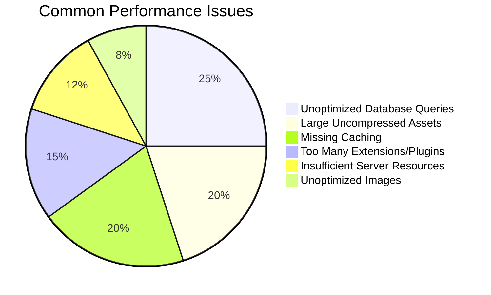
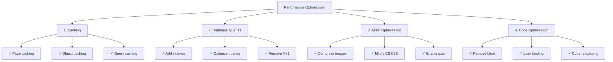
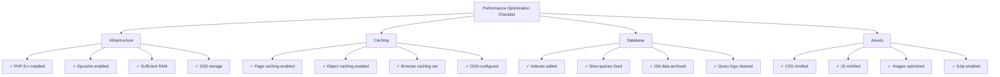

# Performance Frequently Asked Questions

> Common questions and answers about optimizing XOOPS performance and diagnosing slow sites.

---

## General Performance

### Q: How can I tell if my XOOPS site is slow?

**A:** Use these tools and metrics:

1. **Page Load Time**:
```bash
# Use curl to measure response time
curl -w "@curl-format.txt" -o /dev/null -s https://yoursite.com

# Or use online tools
# - PageSpeed Insights (Google)
# - GTmetrix
# - WebPageTest
```

2. **Target Metrics**:
- First Contentful Paint (FCP): < 1.8s
- Largest Contentful Paint (LCP): < 2.5s
- Time to First Byte (TTFB): < 0.6s
- Total page size: < 2-3 MB

3. **Check Server Logs**:
```bash
# Apache
tail -100 /var/log/apache2/access.log

# Nginx
tail -100 /var/log/nginx/access.log

# Look for slow requests (> 1 second)
```

---

### Q: What are the most common performance issues?

**A:**


---

### Q: Where should I focus my optimization efforts?

**A:** Follow the optimization priority:



---

## Caching

### Q: How do I enable caching in XOOPS?

**A:** XOOPS has built-in caching. Configure in Admin > Settings > Performance:

```php
<?php
// Check cache settings in mainfile.php or admin
// Common cache types:
// 1. file - File-based cache (default)
// 2. memcache - Memcached (if installed)
// 3. redis - Redis (if installed)

// In code, use cache:
$cache = xoops_cache_handler::getInstance();

// Read from cache
$data = $cache->read('cache_key');

if ($data === false) {
    // Not in cache, get from source
    $data = expensive_operation();

    // Write to cache (3600 = 1 hour)
    $cache->write('cache_key', $data, 3600);
}
?>
```

---

### Q: What type of caching should I use?

**A:**
- **File Cache**: Default, simple, no extra setup. Good for small sites.
- **Memcache**: Faster, memory-based. Better for high-traffic sites.
- **Redis**: Most powerful, supports more data types. Best for scaling.

Install and enable:
```bash
# Install Memcached
sudo apt-get install memcached php-memcached

# Or install Redis
sudo apt-get install redis-server php-redis

# Restart PHP-FPM or Apache
sudo systemctl restart php-fpm
sudo systemctl restart apache2
```

Then enable in XOOPS admin.

---

### Q: How do I clear XOOPS cache?

**A:**
```bash
# Clear all cache
rm -rf xoops_data/caches/*

# Clear Smarty cache specifically
rm -rf xoops_data/caches/smarty_cache/*
rm -rf xoops_data/caches/smarty_compile/*

# Or in admin panel
Go to Admin > System > Maintenance > Clear Cache
```

In code:
```php
<?php
$cache = xoops_cache_handler::getInstance();
$cache->deleteAll();

// Or clear specific keys
$cache->delete('cache_key');
?>
```

---

### Q: How long should I cache data?

**A:** Depends on data freshness requirements:

```php
<?php
// 5 minutes - Frequently changing data
$cache->write('key', $data, 300);

// 1 hour - Semi-static data
$cache->write('key', $data, 3600);

// 24 hours - Static data, images, etc.
$cache->write('key', $data, 86400);

// No expiration (until manual clear)
$cache->write('key', $data, 0);

// Cache during current request only
$cache->write('key', $data, 1);
?>
```

---

## Database Optimization

### Q: How can I find slow database queries?

**A:** Enable query logging:

```php
<?php
// In mainfile.php
define('XOOPS_DB_DEBUGMODE', true);
define('XOOPS_SQL_DEBUG', true);

// Then check xoops_log table
SELECT * FROM xoops_log WHERE logid > SOME_NUMBER
ORDER BY created DESC LIMIT 20;
?>
```

Or use MySQL slow query log:
```bash
# Enable in /etc/mysql/my.cnf
[mysqld]
slow_query_log = 1
slow_query_log_file = /var/log/mysql/slow.log
long_query_time = 1  # Log queries > 1 second

# View slow queries
tail -100 /var/log/mysql/slow.log
```

---

### Q: How do I optimize database queries?

**A:** Follow these steps:

**1. Add Database Indexes**
```sql
-- Add index to frequently searched columns
ALTER TABLE `xoops_articles` ADD INDEX `author_id` (`author_id`);
ALTER TABLE `xoops_articles` ADD INDEX `created` (`created`);

-- Check if index helps
ANALYZE TABLE `xoops_articles`;
EXPLAIN SELECT * FROM xoops_articles WHERE author_id = 5;
```

**2. Use LIMIT and Pagination**
```php
<?php
// WRONG - Gets all records
$result = $db->query("SELECT * FROM xoops_articles");

// CORRECT - Gets 10 records starting at offset
$limit = 10;
$offset = 0;  // Change with pagination
$result = $db->query(
    "SELECT * FROM xoops_articles LIMIT $limit OFFSET $offset"
);
?>
```

**3. Select Only Needed Columns**
```php
<?php
// WRONG
$result = $db->query("SELECT * FROM xoops_articles");

// CORRECT
$result = $db->query(
    "SELECT id, title, author_id, created FROM xoops_articles"
);
?>
```

**4. Avoid N+1 Queries**
```php
<?php
// WRONG - N+1 problem
$articles = $db->query("SELECT * FROM xoops_articles");
while ($article = $articles->fetch_assoc()) {
    // This query runs once per article!
    $author = $db->query(
        "SELECT * FROM xoops_users WHERE uid = " . $article['author_id']
    );
}

// CORRECT - Use JOIN
$result = $db->query("
    SELECT a.*, u.uname, u.email
    FROM xoops_articles a
    JOIN xoops_users u ON a.author_id = u.uid
");

while ($row = $result->fetch_assoc()) {
    echo $row['title'] . " by " . $row['uname'];
}
?>
```

**5. Use EXPLAIN to Analyze Queries**
```sql
EXPLAIN SELECT * FROM xoops_articles WHERE author_id = 5 AND status = 1;

-- Look for:
-- - type: ALL (bad), INDEX (ok), const/ref (good)
-- - possible_keys: Should show available indexes
-- - key: Should use best index
-- - rows: Should be low number
```

---

### Q: How do I reduce database load?

**A:**
1. **Cache query results**:
```php
<?php
$cache = xoops_cache_handler::getInstance();
$articles = $cache->read('all_articles');

if ($articles === false) {
    $result = $db->query("SELECT * FROM xoops_articles");
    $articles = $result->fetch_all();
    $cache->write('all_articles', $articles, 3600);
}
?>
```

2. **Archive old data** into separate tables
3. **Clean up logs** regularly:
```bash
# Delete old log entries (older than 30 days)
DELETE FROM xoops_log WHERE created < NOW() - INTERVAL 30 DAY;
```

4. **Enable query cache** (MySQL):
```sql
SET GLOBAL query_cache_type = 1;
SET GLOBAL query_cache_size = 268435456;  -- 256 MB
```

---

## Asset Optimization

### Q: How do I optimize CSS and JavaScript?

**A:**

**1. Minify Files**:
```bash
# Using online tools
# - cssminifier.com
# - javascript-minifier.com
# - minify.org

# Or with command-line tools
sudo apt-get install yui-compressor closure-compiler
yui-compressor file.css -o file.min.css
```

**2. Combine Related Files**:
```html
{* Instead of many files *}
<link rel="stylesheet" href="{$xoops_url}/themes/{$xoops_theme}/style1.css">
<link rel="stylesheet" href="{$xoops_url}/themes/{$xoops_theme}/style2.css">
<link rel="stylesheet" href="{$xoops_url}/themes/{$xoops_theme}/style3.css">

{* Combine into one *}
<link rel="stylesheet" href="{$xoops_url}/themes/{$xoops_theme}/style.css">
```

**3. Defer Non-Critical JavaScript**:
```html
{* Critical JS - load immediately *}
<script src="critical.js"></script>

{* Non-critical JS - load after page *}
<script src="analytics.js" defer></script>
<script src="ads.js" async></script>
```

**4. Enable Gzip Compression** (.htaccess):
```apache
<IfModule mod_deflate.c>
    AddOutputFilterByType DEFLATE text/html
    AddOutputFilterByType DEFLATE text/plain
    AddOutputFilterByType DEFLATE text/xml
    AddOutputFilterByType DEFLATE text/css
    AddOutputFilterByType DEFLATE text/javascript
    AddOutputFilterByType DEFLATE application/javascript
    AddOutputFilterByType DEFLATE application/xml
</IfModule>
```

---

### Q: How do I optimize images?

**A:**

**1. Choose Right Format**:
- JPG: Photos and complex images
- PNG: Graphics and images with transparency
- WebP: Modern browsers, better compression
- AVIF: Newest, best compression

**2. Compress Images**:
```bash
# Using ImageMagick
convert image.jpg -quality 85 image-compressed.jpg

# Using ImageOptim
imageoptim image.jpg

# Online tools
# - imagecompressor.com
# - tinypng.com
```

**3. Serve Responsive Images**:
```html
{* Serve different sizes *}
<picture>
    <source srcset="image-large.webp" type="image/webp" media="(min-width: 1200px)">
    <source srcset="image-medium.webp" type="image/webp" media="(min-width: 768px)">
    <source srcset="image-small.webp" type="image/webp">
    
</picture>
```

**4. Lazy Load Images**:
```html
{* Native lazy loading *}


{* Or with JavaScript library *}
<script src="https://cdn.jsdelivr.net/npm/lazysizes@5/lazysizes.min.js"></script>

```

---

## Server Configuration

### Q: How do I check server performance?

**A:**

```bash
# CPU and Memory
top -b -n 1 | head -20
free -h
df -h

# Check PHP-FPM processes
ps aux | grep php-fpm

# Check Apache/Nginx connections
netstat -an | grep ESTABLISHED | wc -l

# Monitor in real-time
watch 'free -h && echo "---" && df -h'
```

---

### Q: How do I optimize PHP for XOOPS?

**A:** Edit `/etc/php/8.x/fpm/php.ini`:

```ini
; Increase limits for XOOPS
max_execution_time = 300         ; 30 seconds default
memory_limit = 512M              ; 128MB default
upload_max_filesize = 100M       ; 2MB default
post_max_size = 100M             ; 8MB default

; Enable opcache for performance
opcache.enable = 1
opcache.memory_consumption = 256
opcache.max_accelerated_files = 20000
opcache.validate_timestamps = 0   ; Production: 0 (reload on restart)
opcache.revalidate_freq = 0       ; Production: 0 or high number

; Database
default_socket_timeout = 60
mysqli.default_socket = /run/mysqld/mysqld.sock
```

Then restart PHP:
```bash
sudo systemctl restart php8.2-fpm
# or
sudo systemctl restart apache2
```

---

### Q: How do I enable HTTP/2 and compression?

**A:** For Apache (.htaccess):
```apache
# Enable HTTPS (required for HTTP/2)
<IfModule mod_ssl.c>
    Protocols h2 http/1.1
</IfModule>

# Enable compression
<IfModule mod_deflate.c>
    AddOutputFilterByType DEFLATE text/html text/plain text/css text/javascript application/javascript
</IfModule>

# Enable browser caching
<IfModule mod_expires.c>
    ExpiresActive On
    ExpiresByType image/jpeg "access plus 1 year"
    ExpiresByType image/png "access plus 1 year"
    ExpiresByType text/css "access plus 1 month"
    ExpiresByType text/javascript "access plus 1 month"
</IfModule>
```

For Nginx (nginx.conf):
```nginx
http {
    # Enable gzip
    gzip on;
    gzip_types text/plain text/css text/javascript application/json;
    gzip_min_length 1000;

    # Enable HTTP/2
    listen 443 ssl http2;

    # Browser caching
    expires 1y;
    add_header Cache-Control "public, immutable";
}
```

---

## Monitoring & Diagnostics

### Q: How do I monitor XOOPS performance over time?

**A:**

**1. Use Google Analytics**:
- Core Web Vitals
- Page load times
- User behavior

**2. Use Server Monitoring Tools**:
```bash
# Install Glances (system monitor)
sudo apt-get install glances
glances

# Or use New Relic, DataDog, etc.
```

**3. Log and Analyze Requests**:
```bash
# Get average response time
grep "GET /index.php" /var/log/apache2/access.log | \
  awk '{print $NF}' | \
  sort -n | \
  awk '{sum+=$1; count++} END {print "Average: " sum/count " ms"}'
```

---

### Q: How do I identify memory leaks?

**A:**

```php
<?php
// In code, track memory usage
$start_memory = memory_get_usage();

// Do operations
for ($i = 0; $i < 1000; $i++) {
    $array[] = expensive_operation();
}

$end_memory = memory_get_usage();
$used = ($end_memory - $start_memory) / 1024 / 1024;

if ($used > 50) {  // Alert if > 50MB
    error_log("Memory leak detected: " . $used . " MB");
}

// Check peak memory
$peak = memory_get_peak_usage();
echo "Peak memory: " . ($peak / 1024 / 1024) . " MB";
?>
```

---

## Performance Checklist



---

## Related Documentation

- [[../Debugging/Database-Debugging|Database Debugging]]
- [[../Debugging/Enable-Debug-Mode|Enable Debug Mode]]
- [[../FAQ/Module-FAQ|Module FAQ]]
- [[../../01-Getting-Started/Configuration/Performance-Optimization|Performance Optimization]]

---

#xoops #performance #optimization #faq #troubleshooting #caching
