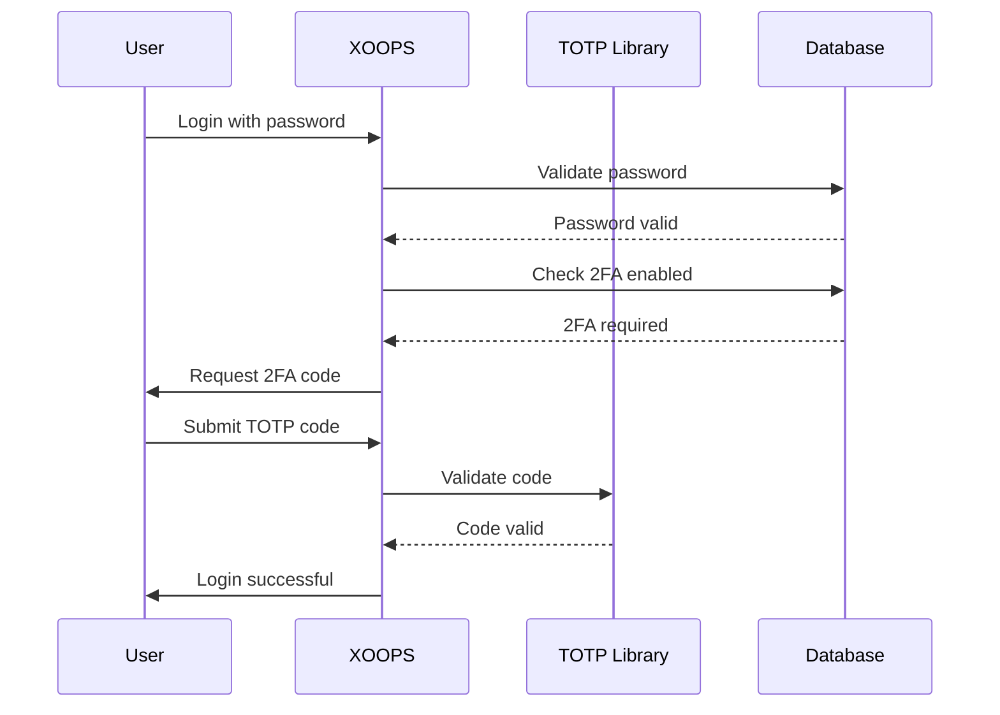

# ADR-006: Two-Factor Authentication Implementation

## Status

Proposed

## Context

XOOPS needs enhanced security for user authentication. Two-factor authentication (2FA) provides an additional layer of security beyond passwords, protecting accounts even if passwords are compromised.

Key considerations:
- Backward compatibility with existing authentication
- Support for multiple 2FA methods
- User experience during setup and login
- Recovery mechanisms for lost devices
- Integration with existing permission system

## Decision

We will implement TOTP (Time-based One-Time Password) as the primary 2FA method with support for backup codes.

### Implementation Approach



### Database Schema

```sql
CREATE TABLE `{PREFIX}_users_2fa` (
    `user_id` INT(11) NOT NULL,
    `secret` VARCHAR(32) NOT NULL,
    `enabled` TINYINT(1) DEFAULT 0,
    `backup_codes` TEXT,
    `last_used` INT(11),
    `created` INT(11) NOT NULL,
    PRIMARY KEY (`user_id`),
    FOREIGN KEY (`user_id`) REFERENCES `{PREFIX}_users`(`uid`)
);
```

### Service Interface

```php
interface TwoFactorAuthInterface
{
    public function enable(int $userId): TwoFactorSetup;
    public function disable(int $userId): void;
    public function verify(int $userId, string $code): bool;
    public function generateBackupCodes(int $userId): array;
    public function isEnabled(int $userId): bool;
}
```

### Middleware Integration

```php
class TwoFactorMiddleware implements MiddlewareInterface
{
    public function process(
        ServerRequestInterface $request,
        RequestHandlerInterface $handler
    ): ResponseInterface {
        $session = $request->getAttribute('session');

        if ($session->has('pending_2fa_user_id')) {
            // User needs to complete 2FA
            if ($this->isVerificationRequest($request)) {
                return $handler->handle($request);
            }
            return new RedirectResponse('/2fa/verify');
        }

        return $handler->handle($request);
    }
}
```

## Consequences

### Positive

- Significantly improved account security
- Industry-standard TOTP compatibility (Google Authenticator, Authy, etc.)
- Backup codes prevent account lockout
- Optional per-user - doesn't force adoption
- PSR-15 middleware allows clean integration

### Negative

- Additional login step impacts user experience
- Users must manage authenticator apps
- Lost devices require recovery process
- Additional database storage and queries
- Requires cryptographic library dependency

### Migration Path

1. Add database table for 2FA data
2. Implement TOTP service with library dependency
3. Add middleware to authentication chain
4. Create setup and verification UI
5. Admin option to require 2FA for specific groups

## Alternatives Considered

### SMS-based OTP

Rejected due to:
- SIM swapping vulnerabilities
- Cost of SMS gateway
- Phone number verification complexity
- Privacy concerns

### Hardware Security Keys (WebAuthn)

Deferred for future ADR:
- More complex implementation
- Limited browser support historically
- Higher user cost
- Could be added alongside TOTP later

### Email-based OTP

Rejected due to:
- Email account compromise defeats purpose
- Delivery delays impact UX
- Spam filter issues

## References

- [RFC 6238 - TOTP](https://tools.ietf.org/html/rfc6238)
- [Google Authenticator Key Format](https://github.com/google/google-authenticator/wiki/Key-Uri-Format)
- [[../../02-Core-Concepts/Security/Security-Best-Practices]] - Security guidelines
- [[../../02-Core-Concepts/Users-Permissions/Authentication]] - Auth system documentation
