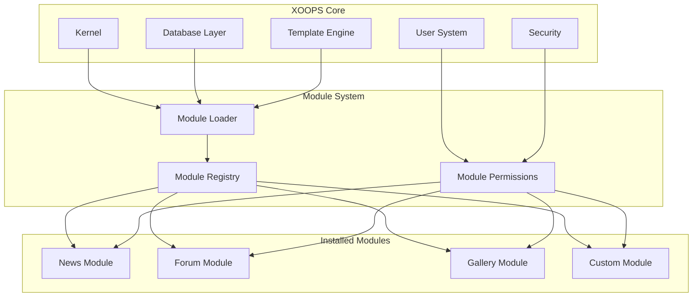
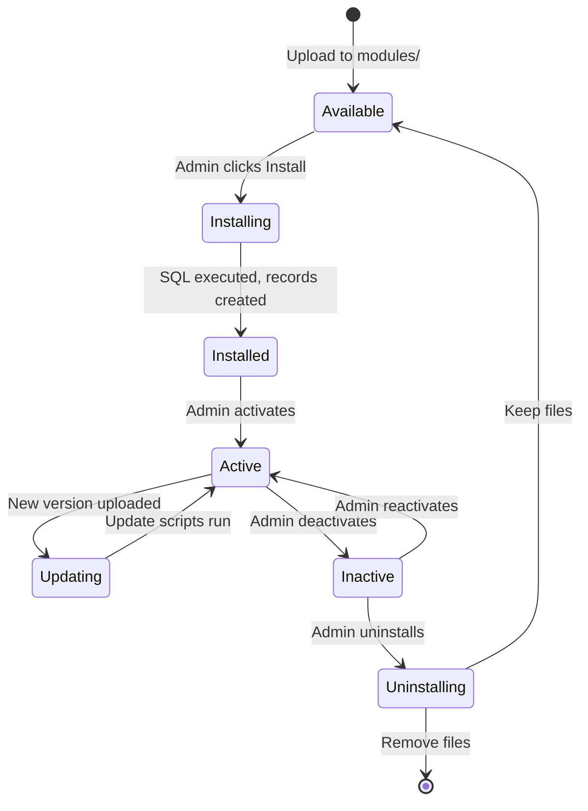

# ADR-001: Modular Architecture

> Architecture Decision Record for XOOPS's core modular design philosophy.

---

## Status

**Accepted** - Foundational decision since XOOPS inception

---

## Context

XOOPS (eXtensible Object-Oriented Portal System) needed an architecture that would:

1. Allow third-party developers to extend functionality
2. Enable site administrators to customize without coding
3. Support independent development and updates
4. Provide isolation between different features
5. Scale from simple blogs to complex portals

The early 2000s CMS landscape offered monolithic systems that were difficult to customize and extend.

---

## Decision Diagram



---

## Decision

We will implement a **modular architecture** where:

### 1. Core Provides Infrastructure
- Database abstraction
- User authentication and permissions
- Template rendering (Smarty)
- Security utilities
- Form generation
- Common utilities

### 2. Modules Are Self-Contained
Each module:
- Has its own directory structure
- Contains its own classes, templates, SQL
- Defines its own configuration
- Can be installed/uninstalled independently
- Has version tracking

### 3. Standard Module Structure
```
modules/modulename/
├── admin/                  # Admin interface
│   ├── index.php
│   └── menu.php
├── class/                  # PHP classes
├── include/                # Include files
├── language/               # Translations
├── sql/                    # Database schema
├── templates/              # Smarty templates
├── blocks/                 # Block definitions
├── xoops_version.php       # Module manifest
├── index.php               # Entry point
└── header.php              # Module bootstrap
```

### 4. Module Manifest (xoops_version.php)
```php
<?php
$modversion['name']        = 'Module Name';
$modversion['version']     = '1.0.0';
$modversion['description'] = 'Module description';
$modversion['dirname']     = basename(__DIR__);
$modversion['hasMain']     = 1;
$modversion['hasAdmin']    = 1;
$modversion['sqlfile']['mysql'] = 'sql/mysql.sql';
$modversion['tables']      = ['modulename_table1'];
$modversion['templates']   = [...];
$modversion['config']      = [...];
$modversion['blocks']      = [...];
```

### 5. Module Communication
- Through core APIs (handlers, events)
- Database relationships
- Preload hooks
- Shared services

---

## Module Lifecycle



---

## Consequences

### Positive

1. **Extensibility**: Thousands of modules created by community
2. **Independence**: Modules can be developed separately
3. **Flexibility**: Sites can mix and match features
4. **Maintainability**: Updates don't affect other modules
5. **Marketplace**: Module ecosystem emerged
6. **Learning curve**: Developers learn one pattern

### Negative

1. **Overhead**: Each module has bootstrap cost
2. **Duplication**: Common code may be repeated
3. **Integration**: Cross-module features need careful design
4. **Versioning**: Module compatibility management needed
5. **Quality variance**: Third-party module quality varies

### Neutral

1. **Database**: Each module manages its own tables
2. **Templates**: Theme must accommodate various modules
3. **Updates**: Core and modules update independently

---

## Alternatives Considered

### 1. Monolithic Architecture
**Rejected** - Too rigid, difficult to customize

### 2. Plugin Architecture (WordPress-style)
**Partially adopted** - Blocks and preloads provide plugin-like hooks within modules

### 3. Component Architecture (Joomla-style)
**Rejected** - More complex, less developer-friendly

### 4. Microservices
**Not applicable** - Too complex for shared hosting era

---

## Related Decisions

- [[ADR-002-Database-Abstraction|ADR-002: Object-Oriented Database Access]]
- [[ADR-003-Template-Engine|ADR-003: Smarty Template Engine]]
- [[ADR-005-Module-Permissions|ADR-005: Permission System]]

---

## References

- XOOPS Project History
- PHP Application Architecture Patterns
- CMS Comparison Studies (2001-2005)

---

#xoops #architecture #adr #modules #design-decision
