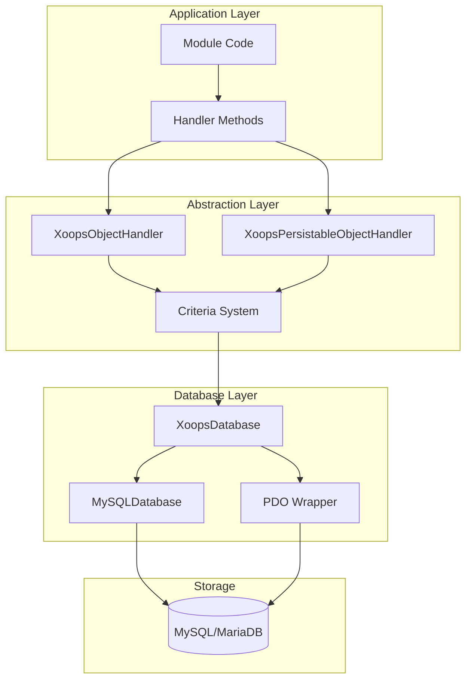
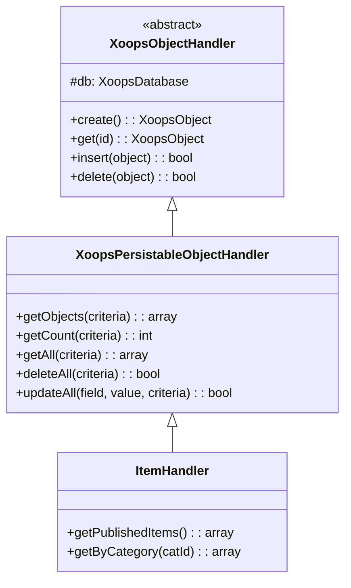
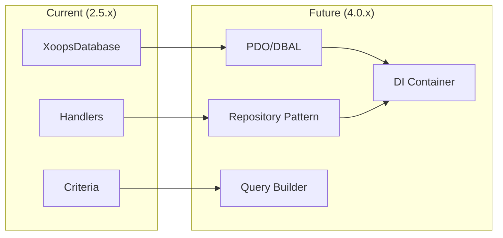

# ADR-002: Database Abstraction

> Architecture Decision Record for XOOPS's object-oriented database access pattern.

---

## Status

**Accepted** - Core pattern since XOOPS 2.0

---

## Context

XOOPS needed a database interaction strategy that would:

1. Abstract away database-specific SQL syntax
2. Provide consistent CRUD operations across all modules
3. Enable automatic data sanitization and escaping
4. Support future database engine changes
5. Simplify common operations for developers

The alternatives were:
- Raw SQL throughout the codebase
- Full ORM (Doctrine, Eloquent)
- Custom lightweight abstraction

---

## Decision Diagram



---

## Decision

We will implement a **Handler Pattern** with:

### 1. XoopsObject - Data Container

Each data entity extends XoopsObject:

```php
class Item extends XoopsObject
{
    public function __construct()
    {
        $this->initVar('id', XOBJ_DTYPE_INT, null, false);
        $this->initVar('title', XOBJ_DTYPE_TXTBOX, '', true, 255);
        $this->initVar('content', XOBJ_DTYPE_TXTAREA, '', false);
        $this->initVar('status', XOBJ_DTYPE_INT, 0, false);
    }
}
```

### 2. Handler - Operations Manager

Each object has a corresponding handler:

```php
class ItemHandler extends XoopsPersistableObjectHandler
{
    public function __construct($db)
    {
        parent::__construct($db, 'mymodule_items', Item::class, 'id', 'title');
    }

    // CRUD methods inherited:
    // - create(), get(), insert(), delete()
    // - getObjects(), getCount(), getAll()
}
```

### 3. Criteria - Query Builder

Object-oriented query conditions:

```php
$criteria = new CriteriaCompo();
$criteria->add(new Criteria('status', 1));
$criteria->add(new Criteria('created', time() - 86400, '>='));
$criteria->setSort('created');
$criteria->setOrder('DESC');
$criteria->setLimit(10);

$items = $handler->getObjects($criteria);
```

---

## Data Type Constants

```php
// Variable types with automatic sanitization
XOBJ_DTYPE_INT       // Integer
XOBJ_DTYPE_TXTBOX    // Single-line text (escaped)
XOBJ_DTYPE_TXTAREA   // Multi-line text (escaped)
XOBJ_DTYPE_EMAIL     // Email validation
XOBJ_DTYPE_URL       // URL validation
XOBJ_DTYPE_ARRAY     // Serialized array
XOBJ_DTYPE_OTHER     // No processing
XOBJ_DTYPE_FLOAT     // Floating point
```

---

## Handler Inheritance



---

## Consequences

### Positive

1. **Consistency**: All modules use same patterns
2. **Security**: Automatic escaping prevents SQL injection
3. **Simplicity**: Common operations require minimal code
4. **Maintainability**: Changes to database layer don't affect modules
5. **Testability**: Handlers can be mocked for testing

### Negative

1. **Performance**: Extra abstraction overhead
2. **Complexity**: Learning curve for new developers
3. **Limitations**: Complex queries may need raw SQL
4. **N+1 Problem**: No built-in eager loading

### Mitigations

- **Performance**: Cache frequently accessed objects
- **Complex queries**: Allow raw SQL when needed
- **N+1**: Use getAll() with proper criteria

---

## Evolution to XOOPS 4.0



XOOPS 4.0 plans:
- Doctrine DBAL for database abstraction
- Repository pattern replacing handlers
- Query builder for complex queries
- Full PSR-11 container integration

---

## Code Examples

### Basic CRUD

```php
$helper = Helper::getInstance();
$handler = $helper->getHandler('Item');

// Create
$item = $handler->create();
$item->setVar('title', 'New Item');
$handler->insert($item);

// Read
$item = $handler->get($id);
$title = $item->getVar('title');

// Update
$item->setVar('title', 'Updated Title');
$handler->insert($item);

// Delete
$handler->delete($item);
```

### Complex Query

```php
$criteria = new CriteriaCompo();
$criteria->add(new Criteria('status', 'published'));
$criteria->add(new Criteria('category_id', '(1,2,3)', 'IN'));
$criteria->add(new Criteria('created', strtotime('-30 days'), '>='));
$criteria->setSort('views');
$criteria->setOrder('DESC');
$criteria->setLimit(10);
$criteria->setStart(0);

$items = $handler->getObjects($criteria);
$total = $handler->getCount($criteria);
```

---

## Related Decisions

- [[ADR-001-Modular-Architecture|ADR-001: Modular Architecture]]
- [[ADR-003-Template-Engine|ADR-003: Smarty Template Engine]]

---

## References

- Martin Fowler - Patterns of Enterprise Application Architecture
- Domain-Driven Design concepts
- Active Record vs Data Mapper patterns

---

#xoops #architecture #adr #database #handler #design-decision
