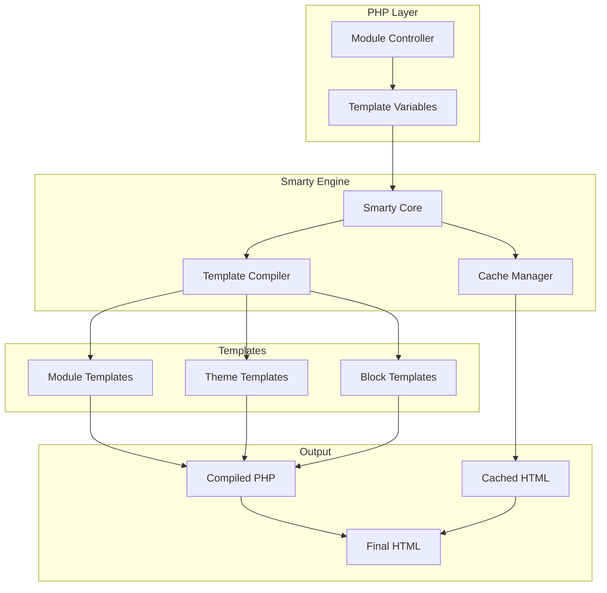
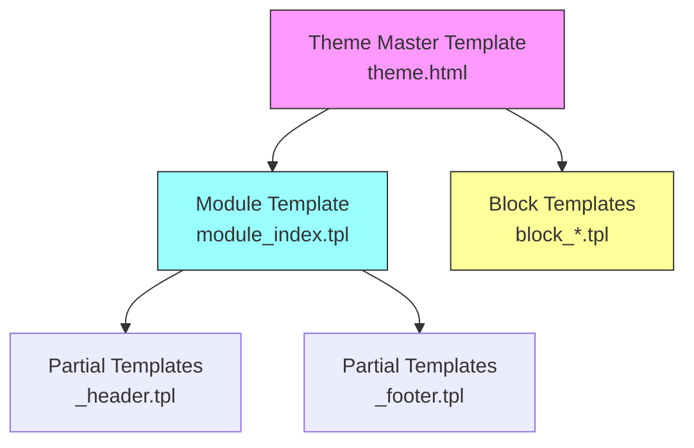
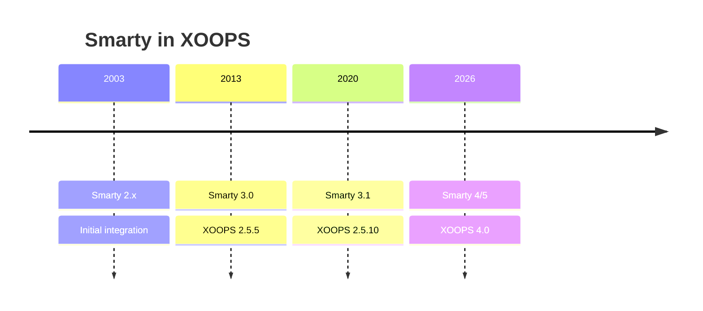

# ADR-003: Template Engine (Smarty)

> Architecture Decision Record for XOOPS's adoption of the Smarty template engine.

---

## Status

**Accepted** - Core decision since XOOPS 2.0

**Evolving** - Migration to Smarty 4/5 planned for XOOPS 4.0

---

## Context

XOOPS needed a templating solution that would:

1. Separate presentation from business logic
2. Allow theme designers to work without PHP knowledge
3. Support template inheritance and includes
4. Provide caching for performance
5. Enable user-customizable templates
6. Support internationalization

---

## Decision Diagram



---

## Decision

We will use **Smarty** as the template engine because:

### 1. Separation of Concerns

```php
// PHP (Controller) - Business logic
$items = $itemHandler->getPublishedItems();
$xoopsTpl->assign('items', $items);

// Smarty (View) - Presentation
// templates/items.tpl
```

```smarty
{* Smarty template - No PHP logic *}
<{foreach item=item from=$items}>
    <article>
        <h2><{$item.title}></h2>
        <p><{$item.summary}></p>
    </article>
<{/foreach}>
```

### 2. XOOPS Delimiters

XOOPS uses `<{` and `}>` instead of standard `{` `}`:

```smarty
{* Standard Smarty *}
{$variable}

{* XOOPS Smarty - Avoids JavaScript conflicts *}
<{$variable}>
```

### 3. Template Hierarchy



### 4. Template Storage

- **Database**: Customized templates stored for revert capability
- **File System**: Original templates in module directories
- **Cache**: Compiled templates for performance

---

## Smarty Configuration

```php
// XOOPS Smarty initialization
$xoopsTpl = new XoopsTpl();

// Custom delimiters
$xoopsTpl->left_delim = '<{';
$xoopsTpl->right_delim = '}>';

// Caching
$xoopsTpl->caching = XOOPS_TEMPLATE_CACHE;
$xoopsTpl->cache_lifetime = 3600;

// Security
$xoopsTpl->security_policy = new Smarty_Security($xoopsTpl);
$xoopsTpl->security_policy->php_functions = [];
$xoopsTpl->security_policy->php_modifiers = ['escape', 'count'];
```

---

## Template Features Used

### Variables

```smarty
{* Simple variable *}
<{$title}>

{* Object property *}
<{$item.title}>

{* With modifier *}
<{$content|truncate:200:'...'}>

{* Escaped output *}
<{$userInput|escape:'html'}>
```

### Control Structures

```smarty
{* Conditional *}
<{if $isAdmin}>
    <a href="admin.php">Admin</a>
<{elseif $isUser}>
    <a href="profile.php">Profile</a>
<{else}>
    <a href="login.php">Login</a>
<{/if}>

{* Loop *}
<{foreach item=item from=$items name=itemloop}>
    <{$smarty.foreach.itemloop.index}>: <{$item.title}>
<{/foreach}>
```

### Includes

```smarty
{* Include another template *}
<{include file="db:mymodule_header.tpl"}>

{* Include with variables *}
<{include file="db:mymodule_item.tpl" item=$currentItem}>

{* Include from theme *}
<{include file="file:$theme_path/partials/sidebar.tpl"}>
```

---

## Consequences

### Positive

1. **Designer-friendly**: HTML-like syntax
2. **Caching**: Built-in template caching
3. **Security**: PHP code isolation
4. **Flexibility**: Modifiers, functions, plugins
5. **Customization**: Users can modify templates
6. **Community**: Large Smarty ecosystem

### Negative

1. **Learning curve**: Smarty-specific syntax
2. **Overhead**: Compilation step required
3. **Debugging**: Template errors can be cryptic
4. **Version issues**: Breaking changes between versions

### Mitigations

- **Learning**: Comprehensive documentation
- **Performance**: Aggressive caching
- **Debugging**: Debug console, clear error messages
- **Versions**: Compatibility layer in XOOPS

---

## Version History



---

## Migration: Smarty 3 to 4/5

### Breaking Changes

```smarty
{* Smarty 3 - Deprecated *}
<{php}>echo date('Y');<{/php}>

{* Smarty 4+ - Use modifiers or assign from PHP *}
<{$current_year}>

{* Smarty 3 - {section} deprecated *}
<{section name=i loop=$items}>
    <{$items[i].title}>
<{/section}>

{* Smarty 4+ - Use {foreach} *}
<{foreach $items as $item}>
    <{$item.title}>
<{/foreach}>
```

### Compatibility Layer

XOOPS provides a compatibility layer for smooth transitions:

```php
// XoopsTpl extends Smarty with compatibility methods
class XoopsTpl extends Smarty
{
    public function assign($tpl_var, $value = null)
    {
        // Handles both Smarty 3 and 4 syntax
        return parent::assign($tpl_var, $value);
    }
}
```

---

## Alternatives Considered

### 1. Twig
**Pros**: Modern, Symfony ecosystem
**Cons**: Different syntax, migration effort
**Decision**: Possible future option for XOOPS 3.x

### 2. Blade (Laravel)
**Pros**: Clean syntax, popular
**Cons**: Laravel-specific
**Decision**: Not suitable for standalone use

### 3. Native PHP Templates
**Pros**: No learning curve, fast
**Cons**: Security risks, no separation
**Decision**: Rejected for maintainability

---

## Related Decisions

- [[ADR-001-Modular-Architecture|ADR-001: Modular Architecture]]
- [[ADR-002-Database-Abstraction|ADR-002: Database Abstraction]]

---

## References

- Smarty Documentation: https://www.smarty.net/docs/en/
- XOOPS Template System Guide
- MVC Pattern in Web Applications

---

#xoops #architecture #adr #smarty #templates #design-decision
