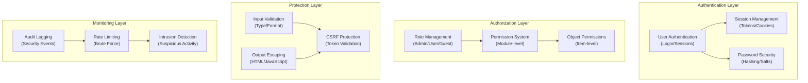

# ADR-004: Security System Architecture

> Comprehensive security architecture for XOOPS CMS protecting against modern threats.

---

## Status

**Accepted** - Core security layer since XOOPS 2.5

---

## Context

### Problem Statement

XOOPS needs a robust security system that:

1. **Protects against common web vulnerabilities** (OWASP Top 10)
2. **Provides granular permission control** across modules
3. **Enables secure user authentication** with modern standards
4. **Prevents data breaches** and unauthorized access
5. **Supports multi-level access control** (admin, moderator, user, guest)
6. **Integrates with all modules** seamlessly

### Current Threats

Modern web attacks include:

- **SQL Injection** - Malicious SQL in user input
- **XSS (Cross-Site Scripting)** - Injected JavaScript in pages
- **CSRF (Cross-Site Request Forgery)** - Unauthorized form submissions
- **Authentication bypass** - Weak session/password handling
- **Authorization bypass** - Privilege escalation
- **Data exposure** - Sensitive data in URLs, logs, or caches

### XOOPS Security Requirements

1. User authentication and session management
2. Role-based access control (RBAC)
3. Permission system for modules and objects
4. Input validation and output escaping
5. Protection against common attacks
6. Audit logging of security events
7. Secure password handling
8. CSRF token protection

---

## Decision

### Core Security Architecture



---

## Security Components

### 1. Authentication System

**User Login Process:**

```php
<?php
// 1. Validate credentials
$user = $userHandler->findByLogin($username);
if (!$user || !password_verify($password, $user->getVar('pass'))) {
    throw new AuthenticationException('Invalid credentials');
}

// 2. Check if account is active
if (!$user->getVar('uactive')) {
    throw new AuthenticationException('Account inactive');
}

// 3. Create secure session
session_regenerate_id(true);
$_SESSION['uid'] = $user->getVar('uid');
$_SESSION['token'] = bin2hex(random_bytes(32));
$_SESSION['created'] = time();

// 4. Log the login
$this->auditLog('USER_LOGIN', $user->getVar('uid'));
```

**Password Security:**

```php
<?php
// Use password_hash (not MD5 or SHA1)
$hashed = password_hash($password, PASSWORD_BCRYPT, [
    'cost' => 12, // High cost = slow brute force
]);

// Verify password
if (!password_verify($inputPassword, $hashed)) {
    throw new Exception('Invalid password');
}

// Rehash if algorithm or cost changed
if (password_needs_rehash($hashed, PASSWORD_BCRYPT, ['cost' => 12])) {
    $newHash = password_hash($password, PASSWORD_BCRYPT, ['cost' => 12]);
    $user->setVar('pass', $newHash);
    $userHandler->insert($user);
}
```

### 2. Session Management

**Secure Session Handling:**

```php
<?php
// Session configuration
ini_set('session.cookie_httponly', true);  // No JS access
ini_set('session.cookie_secure', true);     // HTTPS only
ini_set('session.cookie_samesite', 'Strict'); // CSRF protection
ini_set('session.gc_maxlifetime', 3600);   // 1 hour timeout
ini_set('session.sid_length', 64);         // 64-char session ID

// Validate session
function validateSession() {
    // Check timeout
    if (time() - $_SESSION['created'] > 3600) {
        session_destroy();
        throw new SessionExpiredException();
    }

    // Validate user agent (prevent session hijacking)
    if ($_SESSION['user_agent'] !== $_SERVER['HTTP_USER_AGENT']) {
        throw new SessionInvalidException();
    }

    // Validate IP (optional, can be too strict)
    if (!in_array($_SERVER['REMOTE_ADDR'], $_SESSION['ips'])) {
        $_SESSION['ips'][] = $_SERVER['REMOTE_ADDR'];
    }
}
```

### 3. Authorization (RBAC)

**Role-Based Access Control:**

```php
<?php
class XoopsUser {
    public function hasPermission(string $permissionName): bool
    {
        // Get user groups
        $groups = $this->getGroups();

        // Check if any group has permission
        foreach ($groups as $groupId) {
            if ($this->checkGroupPermission($groupId, $permissionName)) {
                return true;
            }
        }

        return false;
    }

    /**
     * User groups and their permissions
     * Admin: Full access
     * Moderator: Content management
     * User: Create own content
     * Guest: Read-only access
     */
    private function checkGroupPermission(int $groupId, string $permission): bool
    {
        $permissions = [
            1 => ['admin_access'],                 // Admin group
            2 => ['moderate_content', 'edit_own'], // Moderator group
            3 => ['create_content', 'edit_own'],   // User group
            4 => [],                               // Guest group (no permissions)
        ];

        return in_array($permission, $permissions[$groupId] ?? []);
    }
}
```

### 4. Input Validation

**Prevent SQL Injection and Type Errors:**

```php
<?php
// Always use prepared statements
$sql = 'SELECT * FROM users WHERE id = ?';
$result = $db->query($sql, [$userId]); // ✅ Safe

// Input validation
function validateUserInput(array $data): array
{
    return [
        'email' => filter_var($data['email'] ?? '', FILTER_VALIDATE_EMAIL),
        'age' => filter_var($data['age'] ?? 0, FILTER_VALIDATE_INT),
        'website' => filter_var($data['website'] ?? '', FILTER_VALIDATE_URL),
        'title' => substr(trim($data['title'] ?? ''), 0, 255),
    ];
}

// XOOPS Safe Input class
$safe = \Xmf\Request::getHtmlRequest('var_name', '');
$int = \Xmf\Request::getInt('page', 1);
```

### 5. Output Escaping

**Prevent XSS Attacks:**

```php
<?php
// In PHP templates
echo htmlspecialchars($userInput, ENT_QUOTES, 'UTF-8');

// In Smarty templates (automatic escaping)
<{$user_input}>  {* Escaped by default *}
<{$html|escape:false}>  {* Only when needed *}

// JavaScript context
<script>
var message = "<{$userMessage|escape:'javascript'}>";
</script>

// URL context
<a href="<{$url|escape:'url'}>">Link</a>
```

### 6. CSRF Protection

**Cross-Site Request Forgery Prevention:**

```php
<?php
// Generate CSRF token
session_start();
if (empty($_SESSION['csrf_token'])) {
    $_SESSION['csrf_token'] = bin2hex(random_bytes(32));
}

// In forms
<form method="POST">
    <input type="hidden" name="csrf_token" value="<{$csrf_token}>">
    <button type="submit">Submit</button>
</form>

// Validate token
if ($_SERVER['REQUEST_METHOD'] === 'POST') {
    if (hash_equals($_SESSION['csrf_token'], $_POST['csrf_token'] ?? '')) {
        // Process form
    } else {
        throw new InvalidTokenException('CSRF token invalid');
    }
}
```

---

## Consequences

### Positive Effects

1. **Comprehensive Protection** - Covers major vulnerability classes
2. **Layered Security** - Multiple layers of defense
3. **Flexible RBAC** - Fine-grained permission control
4. **Audit Trail** - Track security events
5. **Industry Standard** - Aligns with OWASP recommendations
6. **Module Integration** - Easy for modules to use security APIs

### Negative Effects

1. **Complexity** - More code and configuration needed
2. **Performance** - Hashing and validation add overhead
3. **User Experience** - Security sometimes inconvenient
4. **Maintenance** - Requires ongoing security updates
5. **Training Required** - Developers must follow practices

### Risks and Mitigations

| Risk | Severity | Mitigation |
|------|----------|-----------|
| Developer ignores security | High | Code review, security training |
| New vulnerabilities discovered | Medium | Regular security audits, updates |
| Performance impact | Low | Optimize hot paths, caching |
| Overly complex permissions | Medium | Clear documentation, examples |

---

## Security Best Practices

### For Module Developers

```php
<?php
// ✅ DO: Use prepared statements
$result = $db->prepare('SELECT * FROM table WHERE id = ?')->execute([$id]);

// ❌ DON'T: Concatenate queries
$result = $db->query("SELECT * FROM table WHERE id = $id");

// ✅ DO: Escape output
echo htmlspecialchars($user_input, ENT_QUOTES, 'UTF-8');

// ❌ DON'T: Output raw user data
echo $user_input;

// ✅ DO: Check permissions
if (!$user->hasPermission('edit_content')) {
    throw new PermissionException();
}

// ❌ DON'T: Trust user roles directly
if ($_POST['is_admin']) {
    // Make user admin - SECURITY HOLE!
}

// ✅ DO: Validate input types
$page = (int)$_GET['page'];

// ❌ DON'T: Use untrusted values directly
$sql .= " LIMIT " . $_GET['limit'];
```

---

## Alternatives Considered

### OAuth/OpenID Connect

**Why not chosen initially:** Too complex for shared hosting environment, but good for future integration with external auth systems.

### Two-Factor Authentication (2FA)

**Status:** Accepted as extension, not core requirement, see [[../ADRs/ADR-006-Two-Factor-Auth|ADR-006]]

### HTTP-only Session Cookies

**Status:** Implemented - prevents JavaScript access to session data

---

## Related Decisions

- [[ADR-001-Modular-Architecture|ADR-001: Modular Architecture]] - Modules implement security
- [[ADR-005-Module-Permissions|ADR-005: Module Permission System]]
- [[../ADRs/ADR-006-Two-Factor-Auth|ADR-006: Two-Factor Authentication (future)]]

---

## References

### Security Standards

- [OWASP Top 10](https://owasp.org/www-project-top-ten/)
- [NIST Cybersecurity Framework](https://www.nist.gov/cyberframework)
- [CWE Top 25](https://cwe.mitre.org/top25/)

### PHP Security

- [PHP Security Manual](https://www.php.net/manual/en/security.php)
- [password_hash() Documentation](https://www.php.net/manual/en/function.password-hash.php)
- [Session Security](https://www.php.net/manual/en/session.security.php)

### Tools

- [OWASP ZAP](https://www.zaproxy.org/) - Security testing
- [Snyk](https://snyk.io/) - Vulnerability scanning
- [SonarQube](https://www.sonarqube.org/) - Code quality

---

## Implementation Checklist

- [ ] User authentication system
- [ ] Session management
- [ ] Password hashing (bcrypt)
- [ ] Role-based access control
- [ ] Module permissions
- [ ] Input validation framework
- [ ] Output escaping (PHP + Smarty)
- [ ] CSRF token protection
- [ ] Security audit logging
- [ ] Rate limiting
- [ ] Security headers

---

## Version History

| Version | Date | Changes |
|---------|------|---------|
| 1.0.0 | 2024-01-28 | Initial document |

---

#xoops #adr #security #architecture #authentication #authorization #rbac
