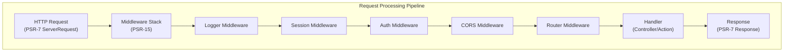

# ADR-005: PSR-15 Middleware Pattern for XOOPS 4.0

> Adopt PSR-15 HTTP server request handlers (middleware) for improved request processing pipeline.

!!! warning "XOOPS 4.0 Proposal — Not Available in 2.5.x"
    This ADR describes a **proposed architecture for XOOPS 4.0**. PSR-15 middleware is **not available in XOOPS 2.5.x**. Current 2.5.x modules use the Page Controller pattern with `mainfile.php` bootstrap. See [[../../02-Core-Concepts/Architecture/XOOPS-Architecture|XOOPS Architecture]] for the current request lifecycle.


---

## Status

**Proposed** - Under evaluation for XOOPS 4.0 release

---

## Context

### Current Approach

XOOPS 2.5 uses a monolithic request handling approach:

```php
// Current: Sequential processing
require_once 'mainfile.php';
// → Kernel initialization
// → User authentication
// → Module loading
// → Page rendering

// All in one flow, mixed concerns
```

### Problems with Current Approach

1. **Mixed Concerns** - Authentication, logging, routing all intertwined
2. **Difficult to Test** - Hard to unit test individual request processing steps
3. **Hard to Extend** - Modules can only hook via preload/events
4. **Poor Separation** - Request processing logic scattered throughout codebase
5. **Not Composable** - Can't easily chain or reorder processing steps

### What is PSR-15 Middleware?

PSR-15 defines a standard interface for HTTP middleware:

```php
<?php
interface RequestHandlerInterface {
    public function handle(ServerRequestInterface $request): ResponseInterface;
}

interface MiddlewareInterface {
    public function process(
        ServerRequestInterface $request,
        RequestHandlerInterface $handler
    ): ResponseInterface;
}
```

**Middleware Chain:**

```
Request
  ↓
[Logger] → logs request
  ↓
[Auth] → validates user session
  ↓
[CORS] → checks cross-origin
  ↓
[Router] → dispatches to handler
  ↓
[Handler] → generates response
  ↓
Response
```

---

## Decision

### Adopt PSR-15 Middleware Stack for XOOPS 4.0

Implement a middleware-based request processing pipeline following PSR-15 standard.

### Architecture Overview



### Core Middleware Components

#### 1. Application Middleware (Core Layer)

```php
<?php
declare(strict_types=1);

namespace XoopsCore;

use Psr\Http\Message\ResponseInterface;
use Psr\Http\Message\ServerRequestInterface;
use Psr\Http\Server\MiddlewareInterface;
use Psr\Http\Server\RequestHandlerInterface;

class SessionMiddleware implements MiddlewareInterface
{
    public function process(
        ServerRequestInterface $request,
        RequestHandlerInterface $handler
    ): ResponseInterface {
        // 1. Retrieve session (or start new)
        $sessionId = $request->getCookieParams()['PHPSESSID'] ?? null;
        $session = $this->sessionManager->load($sessionId);

        // 2. Attach session to request
        $request = $request->withAttribute('session', $session);

        // 3. Pass to next middleware
        $response = $handler->handle($request);

        // 4. Set session cookie if needed
        if ($session->isModified()) {
            $response = $response->withAddedHeader(
                'Set-Cookie',
                'PHPSESSID=' . $session->getId() . '; HttpOnly; SameSite=Strict'
            );
        }

        return $response;
    }
}
```

#### 2. Authentication Middleware

```php
<?php
class AuthMiddleware implements MiddlewareInterface
{
    public function process(
        ServerRequestInterface $request,
        RequestHandlerInterface $handler
    ): ResponseInterface {
        // Get session from previous middleware
        $session = $request->getAttribute('session');

        // Authenticate user from session
        $user = $this->authenticate($session);

        // Attach user to request
        $request = $request->withAttribute('user', $user);

        return $handler->handle($request);
    }

    private function authenticate(?Session $session): User
    {
        if ($session && $session->has('uid')) {
            return $this->userRepository->findById($session->get('uid'));
        }

        return new AnonymousUser();
    }
}
```

#### 3. Authorization Middleware

```php
<?php
class AuthorizationMiddleware implements MiddlewareInterface
{
    public function __construct(private AuthorizationChecker $checker)
    {
    }

    public function process(
        ServerRequestInterface $request,
        RequestHandlerInterface $handler
    ): ResponseInterface {
        $user = $request->getAttribute('user');
        $route = $request->getAttribute('route');

        // Check if user has permission for this route
        if (!$this->checker->isGranted($user, $route)) {
            return new JsonResponse(
                ['error' => 'Unauthorized'],
                403
            );
        }

        return $handler->handle($request);
    }
}
```

#### 4. Module Middleware

```php
<?php
// Modules can provide their own middleware
class PublisherAccessMiddleware implements MiddlewareInterface
{
    public function process(
        ServerRequestInterface $request,
        RequestHandlerInterface $handler
    ): ResponseInterface {
        $user = $request->getAttribute('user');

        // Module-specific access control
        if (!$user->hasPermission('publisher_view')) {
            return new HtmlResponse('Access denied', 403);
        }

        return $handler->handle($request);
    }
}
```

### Implementation Example

```php
<?php
// bootstrap.php - Application setup

use Psr\Http\Message\ServerRequestInterface;
use Psr\Http\Server\RequestHandlerInterface;
use Xoops\Core\Middleware\{
    LoggerMiddleware,
    SessionMiddleware,
    AuthMiddleware,
    CorsMiddleware,
    ErrorHandlingMiddleware
};

// Create middleware pipeline
$middlewareStack = [
    // 1. Error handling (outermost)
    new ErrorHandlingMiddleware(),

    // 2. Logging
    new LoggerMiddleware($logger),

    // 3. CORS handling
    new CorsMiddleware($corsConfig),

    // 4. Session management
    new SessionMiddleware($sessionManager),

    // 5. Authentication
    new AuthMiddleware($userRepository),

    // 6. Authorization
    new AuthorizationMiddleware($authChecker),

    // 7. Routing and dispatching
    new RoutingMiddleware($router),

    // 8. Module middleware (dynamic)
    ...$this->loadModuleMiddleware(),
];

// Process request through middleware stack
$request = ServerRequestFactory::fromGlobals();
$dispatcher = new MiddlewareDispatcher($middlewareStack);
$response = $dispatcher->dispatch($request);

// Send response
http_response_code($response->getStatusCode());
foreach ($response->getHeaders() as $name => $values) {
    foreach ($values as $value) {
        header("$name: $value", false);
    }
}
echo $response->getBody();
```

### Module Integration

Modules can provide middleware:

```php
<?php
// Publisher module - xoops_version.php

$modversion['middleware'] = [
    'PublisherAccessMiddleware' => true,      // Auto-load
    'PublisherLogMiddleware' => true,
];

// Or custom:
$modversion['middleware_factory'] = function() {
    return [
        new PublisherCacheMiddleware(),
        new PublisherPermissionMiddleware(),
    ];
};
```

---

## Consequences

### Positive Effects

1. **Separation of Concerns** - Each middleware handles one responsibility
2. **Testability** - Easy to unit test individual middleware components
3. **Composability** - Middleware can be mixed and reordered
4. **Standards Compliant** - Uses PSR-15 and PSR-7 standards
5. **Extensibility** - Modules can easily add custom middleware
6. **Debugging** - Clear request flow through pipeline
7. **Performance** - Can optimize specific middleware layers
8. **Interoperability** - Can use third-party PSR-15 middleware

### Negative Effects

1. **Learning Curve** - Developers must understand PSR-15
2. **Performance Overhead** - More function calls in pipeline
3. **Complexity** - More moving parts than monolithic approach
4. **Migration Effort** - Requires refactoring existing code
5. **Dependencies** - Requires PSR-7 HTTP library

### Risks and Mitigations

| Risk | Severity | Mitigation |
|------|----------|-----------|
| Complex middleware chains | Medium | Clear documentation, examples |
| Performance degradation | Medium | Benchmark, optimize hot paths |
| Developer misuse | Medium | Code review, best practices guide |
| Migration breaking changes | High | Deprecation period, helpers |
| Middleware ordering issues | Medium | Clear dependency graph |

---

## Implementation Plan

### Phase 1: Foundation (Q2 2026)

- [ ] Implement PSR-7 HTTP message wrapper
- [ ] Create MiddlewareDispatcher
- [ ] Implement core middleware (session, auth)
- [ ] Update kernel to use middleware

### Phase 2: Integration (Q3 2026)

- [ ] Migrate existing functionality to middleware
- [ ] Add module middleware support
- [ ] Create middleware testing utilities
- [ ] Write comprehensive documentation

### Phase 3: Migration (Q4 2026)

- [ ] Provide compatibility layer for old code
- [ ] Help modules update to new middleware
- [ ] Performance optimization
- [ ] Security audit

### Phase 4: Release (Q1 2027)

- [ ] XOOPS 4.0 release with middleware
- [ ] Deprecate old preload/hook system
- [ ] Community feedback and updates

---

## Success Criteria

- [ ] All core functionality migrated to middleware
- [ ] 90%+ test coverage for middleware
- [ ] Documentation complete with examples
- [ ] Performance within 10% of previous version
- [ ] Modules successfully use new middleware system
- [ ] Community adoption rate >80%

---

## Middleware Best Practices

### Do

- Keep middleware focused (single responsibility)
- Use immutability (create new request/response)
- Handle errors gracefully
- Document dependencies
- Add type hints
- Write tests for middleware
- Use standard PSR-15 interfaces

### Don't

- Don't modify shared request/response objects
- Don't access globals directly
- Don't create dependencies on middleware order
- Don't catch all exceptions
- Don't mix business logic with middleware
- Don't make middleware do too much

---

## Examples

### Custom Middleware

```php
<?php
// Example: Rate limiting middleware

use Psr\Http\Message\ResponseInterface;
use Psr\Http\Message\ServerRequestInterface;
use Psr\Http\Server\MiddlewareInterface;
use Psr\Http\Server\RequestHandlerInterface;

class RateLimitMiddleware implements MiddlewareInterface
{
    public function __construct(
        private RateLimiter $limiter,
        private int $limit = 100,
        private int $window = 3600
    ) {
    }

    public function process(
        ServerRequestInterface $request,
        RequestHandlerInterface $handler
    ): ResponseInterface {
        $user = $request->getAttribute('user');
        $identifier = $user->getId() ?? $request->getClientIp();

        // Check rate limit
        $remaining = $this->limiter->check($identifier, $this->limit, $this->window);

        if ($remaining < 0) {
            return new JsonResponse(
                ['error' => 'Rate limit exceeded'],
                429
            );
        }

        // Add rate limit headers
        $response = $handler->handle($request);
        return $response
            ->withAddedHeader('X-RateLimit-Limit', (string)$this->limit)
            ->withAddedHeader('X-RateLimit-Remaining', (string)$remaining);
    }
}
```

---

## Related Decisions

- [[ADR-001-Modular-Architecture|ADR-001: Modular Architecture]] - Foundation
- [[ADR-004-Security-System|ADR-004: Security System]] - Uses middleware for auth
- [[../ADRs/ADR-006-Two-Factor-Auth|ADR-006: Two-Factor Auth]] - Can be middleware

---

## References

### PSR Standards

- [PSR-7: HTTP Message Interface](https://www.php-fig.org/psr/psr-7/)
- [PSR-15: HTTP Server Request Handlers](https://www.php-fig.org/psr/psr-15/)

### Middleware Frameworks

- [Slim Framework](https://www.slimframework.com/) - Middleware examples
- [Zend Expressive](https://docs.zendframework.com/zend-expressive/) - PSR-15 framework
- [Guzzle](https://docs.guzzlephp.org/) - HTTP client middleware

### Tools

- [RelayPHP](https://relayphp.com/) - Middleware library
- [PSR-15 Middleware](https://github.com/middlewares) - Collection of middlewares

---

## Version History

| Version | Date | Changes |
|---------|------|---------|
| 1.0.0 | 2024-01-28 | Initial proposal |

---

#xoops #adr #psr-15 #middleware #architecture #psr-7
