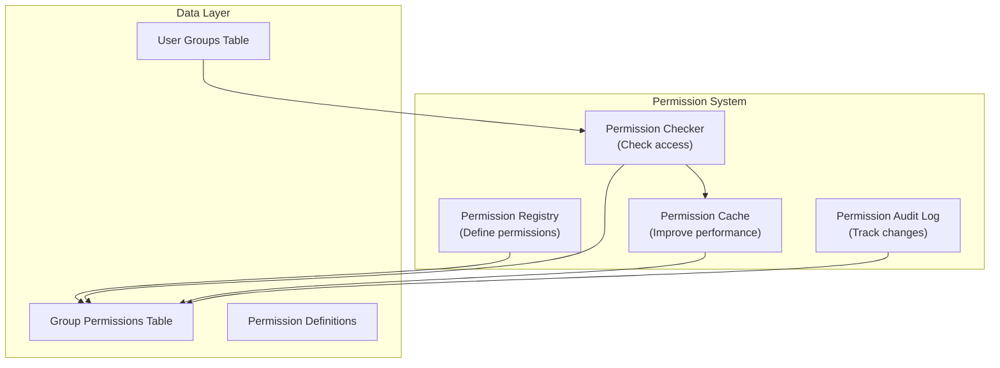

# ADR-006: Module Permission System

> Fine-grained, hierarchical permission system for XOOPS modules enabling granular access control.

---

## Status

**Accepted** - Implemented in XOOPS 2.5.x and extended in 2026

---

## Context

### Problem Statement

XOOPS modules need flexible permission controls that allow:

1. **Module-level permissions** - Can user access this module?
2. **Object-level permissions** - Can user access this specific item?
3. **Action-level permissions** - Can user perform this action?
4. **Custom permissions** - Can modules define their own permissions?

### Current State

XOOPS 2.5 uses the XoopsGroupPermission system:

```php
<?php
$perm_handler = xoops_getHandler('groupperm');
$isAllowed = $perm_handler->checkRight(
    'modulename',
    'action',
    $itemId,
    $groupId
);
```

### Challenges

1. **Complex Queries** - Permission checks require database joins
2. **Limited Hierarchy** - Hard to create permission groups
3. **Poor Caching** - No built-in permission caching
4. **Module Variations** - Each module implements differently
5. **Performance** - Multiple DB queries for permission checks

---

## Decision

### Implement Hierarchical Permission System

Create a standardized, cached permission system supporting:

1. **Hierarchical Permissions** - Inheritance from parent groups
2. **Role-Based Access** - Map permissions to roles (admin, moderator, user, guest)
3. **Object Permissions** - Fine-grained control per item
4. **Caching** - Cache permissions to reduce queries
5. **Custom Permissions** - Modules define their own
6. **Audit Trail** - Log permission changes

### Permission Hierarchy

```
User
  └── Group 1 (Admin)
      └── Permission: admin_module
      └── Permission: edit_all_items
      └── Permission: delete_all_items
  └── Group 2 (Moderator)
      └── Permission: moderate_comments
      └── Permission: edit_own_items
  └── Group 3 (User)
      └── Permission: view_published_items
      └── Permission: edit_own_items
  └── Group 4 (Guest)
      └── Permission: view_published_items
```

### Architecture



---

## Core Components

### 1. Permission Definition

```php
<?php
// Module defines its permissions in xoops_version.php

$modversion['permissions'] = [
    [
        'name' => 'module_view',
        'description' => 'Can view module',
        'level' => 'module',
    ],
    [
        'name' => 'item_view',
        'description' => 'Can view items',
        'level' => 'item',
    ],
    [
        'name' => 'item_create',
        'description' => 'Can create items',
        'level' => 'item',
    ],
    [
        'name' => 'item_edit',
        'description' => 'Can edit items',
        'level' => 'item',
    ],
    [
        'name' => 'item_delete',
        'description' => 'Can delete items',
        'level' => 'item',
    ],
    [
        'name' => 'admin_manage',
        'description' => 'Can manage module',
        'level' => 'admin',
    ],
];

// Default permissions by group
$modversion['group_permissions'] = [
    // Admin group gets all permissions
    '1' => [
        'module_view' => 1,
        'item_view' => 1,
        'item_create' => 1,
        'item_edit' => 1,
        'item_delete' => 1,
        'admin_manage' => 1,
    ],
    // User group
    '3' => [
        'module_view' => 1,
        'item_view' => 1,
        'item_create' => 1,
        'item_edit' => 0,
        'item_delete' => 0,
        'admin_manage' => 0,
    ],
    // Guest group
    '4' => [
        'module_view' => 1,
        'item_view' => 1,
        'item_create' => 0,
        'item_edit' => 0,
        'item_delete' => 0,
        'admin_manage' => 0,
    ],
];
```

### 2. Permission Checker

```php
<?php
declare(strict_types=1);

namespace XoopsCore\Permission;

class PermissionChecker
{
    private PermissionCache $cache;
    private PermissionRepository $repository;

    public function hasPermission(
        User $user,
        string $permissionName,
        ?int $itemId = null
    ): bool {
        // Check cache first
        $cacheKey = "perm_{$user->getId()}_{$permissionName}_{$itemId}";
        if ($this->cache->has($cacheKey)) {
            return $this->cache->get($cacheKey);
        }

        $hasPermission = false;

        // Check all user groups
        foreach ($user->getGroups() as $group) {
            if ($this->checkGroupPermission($group, $permissionName, $itemId)) {
                $hasPermission = true;
                break;
            }
        }

        // Cache result
        $this->cache->set($cacheKey, $hasPermission, 3600);

        // Log high-level access checks
        if ($hasPermission && $this->shouldAuditLog($permissionName)) {
            $this->auditLog('PERMISSION_CHECKED', [
                'user_id' => $user->getId(),
                'permission' => $permissionName,
                'item_id' => $itemId,
                'result' => 'ALLOWED',
            ]);
        }

        return $hasPermission;
    }

    private function checkGroupPermission(
        Group $group,
        string $permissionName,
        ?int $itemId = null
    ): bool {
        $sql = 'SELECT COUNT(*) FROM ' . $this->table . '
                WHERE groupid = ?
                AND permission = ?
                AND itemid = ?
                AND granted = 1';

        $stmt = $this->db->prepare($sql);
        $stmt->execute([$group->getId(), $permissionName, $itemId ?? 0]);

        return $stmt->fetchColumn() > 0;
    }
}
```

### 3. Permission Levels

```php
<?php
// Different permission levels with different scopes

class PermissionLevel
{
    // Module-level: Affects entire module
    public const LEVEL_MODULE = 'module';

    // Admin-level: Admin panel access
    public const LEVEL_ADMIN = 'admin';

    // Item-level: Specific objects/items
    public const LEVEL_ITEM = 'item';

    // Field-level: Specific object fields
    public const LEVEL_FIELD = 'field';

    // Action-level: Specific actions/operations
    public const LEVEL_ACTION = 'action';
}
```

### 4. Object-Level Permissions

```php
<?php
// Fine-grained control for specific items

class Item extends XoopsObject
{
    /**
     * Check if user can view this item
     */
    public function canView(User $user): bool
    {
        // Public items anyone can view
        if ($this->getVar('status') === 'published') {
            return true;
        }

        // Owner can always view their items
        if ($this->getVar('user_id') === $user->getId()) {
            return true;
        }

        // Check group permissions
        $permChecker = xoops_getActiveModule()->getPermissionChecker();
        return $permChecker->hasPermission(
            $user,
            'item_view',
            $this->getVar('id')
        );
    }

    public function canEdit(User $user): bool
    {
        // Owner can edit their items
        if ($this->getVar('user_id') === $user->getId()) {
            return $permChecker->hasPermission($user, 'item_edit', $this->getVar('id'));
        }

        // Check if user can edit all items
        return $permChecker->hasPermission($user, 'item_edit_all', $this->getVar('id'));
    }

    public function canDelete(User $user): bool
    {
        return $permChecker->hasPermission($user, 'item_delete', $this->getVar('id'));
    }
}
```

### 5. Usage in Controllers

```php
<?php
// Example: Article controller

class ArticleController
{
    private PermissionChecker $permChecker;

    public function view(int $id, User $user): Response
    {
        $article = $this->repository->find($id);

        // Check permission
        if (!$article->canView($user)) {
            throw new AccessDeniedException('Cannot view this article');
        }

        return new HtmlResponse($this->renderArticle($article));
    }

    public function edit(int $id, User $user): Response
    {
        $article = $this->repository->find($id);

        // Check permission
        if (!$article->canEdit($user)) {
            throw new AccessDeniedException('Cannot edit this article');
        }

        // Handle form submission
        if ($this->request->isMethod('POST')) {
            $article->setVar('title', $this->request->getPost('title'));
            $article->setVar('content', $this->request->getPost('content'));
            $this->repository->insert($article);

            $this->auditLog('ARTICLE_EDITED', ['id' => $id, 'user_id' => $user->getId()]);

            // Invalidate permission cache
            $this->permChecker->clearCache($user->getId());

            return new RedirectResponse('/article/' . $id);
        }

        return new HtmlResponse($this->renderForm($article));
    }

    public function delete(int $id, User $user): Response
    {
        $article = $this->repository->find($id);

        if (!$article->canDelete($user)) {
            throw new AccessDeniedException('Cannot delete this article');
        }

        $this->repository->delete($article);

        $this->auditLog('ARTICLE_DELETED', ['id' => $id, 'user_id' => $user->getId()]);

        // Invalidate cache
        $this->permChecker->clearCache($user->getId());

        return new JsonResponse(['success' => true]);
    }
}
```

---

## Consequences

### Positive Effects

1. **Granular Control** - Fine-tuned permission management
2. **Standardized** - Consistent across modules
3. **Cached** - Improved performance with caching
4. **Auditable** - Track who changed what
5. **Flexible** - Support custom permissions
6. **Scalable** - Handles complex permission hierarchies
7. **Testable** - Easy to unit test

### Negative Effects

1. **Complexity** - More code to manage
2. **Database Overhead** - More tables and joins
3. **Cache Invalidation** - Must clear cache on changes
4. **Learning Curve** - Developers must understand system
5. **Performance** - If cache not properly configured

### Risks and Mitigations

| Risk | Severity | Mitigation |
|------|----------|-----------|
| Overly complex permissions | Medium | Good defaults, documentation |
| Cache stale data | High | TTL, smart invalidation |
| Performance regression | Medium | Benchmark, optimize queries |
| Permission bypass | High | Security audit, tests |

---

## Permission Design Patterns

### Pattern 1: Owner-Based Permissions

```php
<?php
// User can edit their own items but not others'

public function canEdit(User $user): bool
{
    // Owner can always edit
    if ($this->isOwner($user)) {
        return true;
    }

    // Check group permissions for editing others' items
    return $this->permChecker->hasPermission($user, 'edit_all_items');
}

private function isOwner(User $user): bool
{
    return $this->getVar('user_id') === $user->getId();
}
```

### Pattern 2: Status-Based Permissions

```php
<?php
// Different permissions based on status

public function canView(User $user): bool
{
    switch ($this->getVar('status')) {
        case 'published':
            // Anyone with module permission can view
            return $this->permChecker->hasPermission($user, 'item_view');

        case 'draft':
            // Only owner or admin can view
            return $this->isOwner($user) ||
                   $this->permChecker->hasPermission($user, 'admin_manage');

        case 'archived':
            // Only admin can view
            return $this->permChecker->hasPermission($user, 'admin_manage');

        default:
            return false;
    }
}
```

### Pattern 3: Role-Based Permissions

```php
<?php
// Check against specific roles

public function hasAdminRole(User $user): bool
{
    return $user->getGroups()->contains('admin_group');
}

public function hasModeratorRole(User $user): bool
{
    return $user->getGroups()->contains('moderator_group') ||
           $this->hasAdminRole($user);
}

public function canModerate(User $user): bool
{
    return $this->hasModeratorRole($user);
}
```

---

## Related Decisions

- [[ADR-001-Modular-Architecture|ADR-001: Modular Architecture]] - Modules define permissions
- [[ADR-004-Security-System|ADR-004: Security System]] - Foundation for security
- [[ADR-005-Middleware|ADR-005: Middleware]] - Can enforce permissions

---

## References

### Permission Models

- [RBAC (Role-Based Access Control)](https://en.wikipedia.org/wiki/Role-based_access_control)
- [ABAC (Attribute-Based Access Control)](https://en.wikipedia.org/wiki/Attribute-based_access_control)
- [ACL (Access Control List)](https://en.wikipedia.org/wiki/Access-control_list)

### Implementation

- [Symfony Security](https://symfony.com/doc/current/security.html)
- [Laravel Authorization](https://laravel.com/docs/authorization)

---

## Implementation Checklist

- [ ] Define standard permission levels
- [ ] Create PermissionChecker class
- [ ] Implement caching strategy
- [ ] Add audit logging
- [ ] Create helper functions
- [ ] Write comprehensive tests
- [ ] Document for developers
- [ ] Update all modules
- [ ] Performance optimization
- [ ] Security review

---

## Version History

| Version | Date | Changes |
|---------|------|---------|
| 1.0.0 | 2024-01-28 | Initial document |

---

#xoops #adr #permissions #authorization #rbac #security
