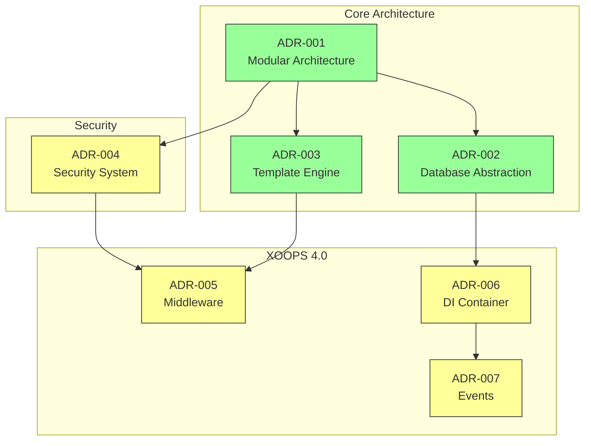
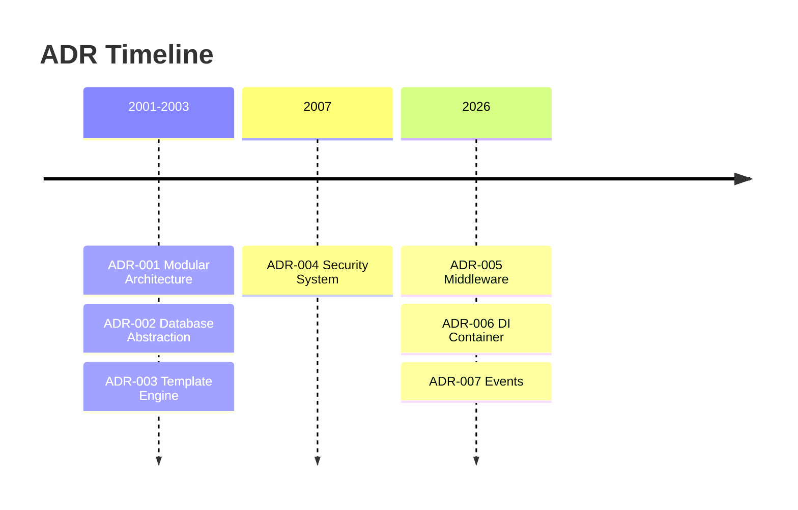

# 📋 Architecture Decision Records Index

> Comprehensive index of architectural decisions that shaped XOOPS CMS.

---

## What are ADRs?

Architecture Decision Records (ADRs) document significant architectural decisions made during the development of XOOPS. They capture the context, decision, and consequences of each choice, providing valuable historical context for maintainers and contributors.

---

## ADR Status Legend

| Status | Meaning |
|--------|---------|
| **Proposed** | Under discussion, not yet accepted |
| **Accepted** | Decision has been adopted |
| **Deprecated** | No longer recommended |
| **Superseded** | Replaced by another ADR |

---

## Current ADRs

### Foundational Decisions

| ADR | Title | Status | Impact |
|-----|-------|--------|--------|
| [[ADR-001-Modular-Architecture|ADR-001]] | Modular Architecture | Accepted | Core |
| [[ADR-002-Database-Abstraction|ADR-002]] | Object-Oriented Database Access | Accepted | Core |
| [[ADR-003-Template-Engine|ADR-003]] | Smarty Template Engine | Accepted | Core |

### Planned ADRs (XOOPS 4.0)

| ADR | Title | Status | Impact |
|-----|-------|--------|--------|
| ADR-004 | Security System Design | Proposed | Security |
| ADR-005 | PSR-15 Middleware | Proposed | Architecture |
| ADR-006 | Dependency Injection Container | Proposed | Architecture |
| ADR-007 | Event System Redesign | Proposed | Architecture |

---

## ADR Relationships



---

## Timeline



---

## Creating New ADRs

When proposing a new architectural decision:

1. Copy the [[ADR-Template|ADR Template]]
2. Fill in all sections
3. Submit as Pull Request
4. Discuss in GitHub Issues
5. Update status after decision

### ADR Template Structure

```markdown
# ADR-XXX: Title

## Status
Proposed | Accepted | Deprecated | Superseded

## Context
What is the issue motivating this decision?

## Decision
What is the change that we're proposing?

## Consequences
What becomes easier or harder as a result?

## Alternatives Considered
What other options were evaluated?
```

---

## 🔗 Related Documentation

- [[../../02-Core-Concepts/Core-Concepts|Core Concepts]]
- [[../Contributing|Contributing Guidelines]]
- [[../../07-XOOPS-4.0/XOOPS-4.0-Roadmap|XOOPS 4.0 Roadmap]]

---

#xoops #adr #architecture #index #decisions
