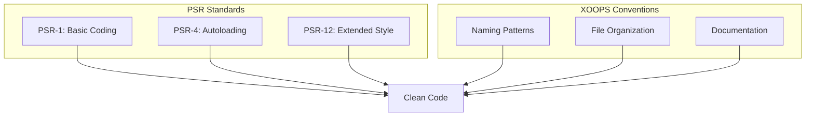

# PHP-Standards

> XOOPS follows PSR-1, PSR-4, and PSR-12 coding standards with XOOPS-specific conventions.

---

## Standards Overview



---

## File Structure

### PHP Tags

```php
<?php
// Always use full PHP tags, never short tags
// Omit closing ?> tag in pure PHP files

declare(strict_types=1);

namespace XoopsModules\MyModule;

// Code here...
```

### File Header

```php
<?php

declare(strict_types=1);

/**
 * XOOPS - PHP Content Management System
 *
 * @package    XoopsModules\MyModule
 * @subpackage Class
 * @author     Your Name <email@example.com>
 * @copyright  2026 XOOPS Project
 * @license    GPL-2.0-or-later
 * @link       https://xoops.org
 */

namespace XoopsModules\MyModule;

use XoopsObject;
use XoopsPersistableObjectHandler;
```

---

## Naming Conventions

### Classes

```php
// PascalCase for class names
class ItemHandler extends XoopsPersistableObjectHandler
{
    // ...
}

// Interfaces end with "Interface"
interface RepositoryInterface
{
    public function find(int $id): ?object;
}

// Traits end with "Trait"
trait TimestampTrait
{
    public function getCreatedAt(): \DateTimeInterface
    {
        // ...
    }
}

// Abstract classes prefix with "Abstract"
abstract class AbstractEntity
{
    // ...
}
```

### Methods and Functions

```php
// camelCase for methods
public function getActiveItems(): array
{
    // ...
}

// Verbs for action methods
public function createItem(array $data): Item
public function updateItem(int $id, array $data): bool
public function deleteItem(int $id): bool
public function findById(int $id): ?Item
public function hasPermission(string $permission): bool
public function isActive(): bool
public function canEdit(): bool
```

### Variables and Properties

```php
class Item
{
    // camelCase for properties
    private int $itemId;
    private string $itemTitle;
    private bool $isPublished;
    private array $categoryIds;

    // camelCase for variables
    public function process(): void
    {
        $itemCount = 0;
        $activeItems = [];
        $isValid = true;
    }
}
```

### Constants

```php
// UPPER_SNAKE_CASE for constants
class Config
{
    public const DEFAULT_ITEMS_PER_PAGE = 10;
    public const MAX_UPLOAD_SIZE = 10485760;
    public const CACHE_LIFETIME = 3600;
}

// Or in define() calls
define('XOOPS_ROOT_PATH', '/path/to/xoops');
define('MYMODULE_VERSION', '1.0.0');
```

---

## Class Structure

```php
<?php

declare(strict_types=1);

namespace XoopsModules\MyModule;

use XoopsDatabase;
use XoopsPersistableObjectHandler;

/**
 * Handler for Item objects
 *
 * @package XoopsModules\MyModule
 */
class ItemHandler extends XoopsPersistableObjectHandler
{
    // 1. Constants
    public const TABLE_NAME = 'mymodule_items';

    // 2. Properties (visibility order: public, protected, private)
    public int $defaultLimit = 10;

    protected string $table;

    private XoopsDatabase $db;

    // 3. Constructor
    public function __construct(?XoopsDatabase $db = null)
    {
        $this->db = $db ?? \XoopsDatabaseFactory::getDatabaseConnection();
        parent::__construct($this->db, self::TABLE_NAME, Item::class, 'id', 'title');
    }

    // 4. Public methods
    public function getPublishedItems(int $limit = 10): array
    {
        $criteria = new \CriteriaCompo();
        $criteria->add(new \Criteria('status', 'published'));
        $criteria->setLimit($limit);

        return $this->getObjects($criteria);
    }

    public function findBySlug(string $slug): ?Item
    {
        $criteria = new \Criteria('slug', $slug);
        $items = $this->getObjects($criteria);

        return $items[0] ?? null;
    }

    // 5. Protected methods
    protected function validateItem(Item $item): bool
    {
        // Validation logic
        return true;
    }

    // 6. Private methods
    private function sanitizeInput(string $input): string
    {
        return htmlspecialchars($input, ENT_QUOTES, 'UTF-8');
    }
}
```

---

## Formatting Rules

### Indentation and Spacing

```php
// Use 4 spaces for indentation (not tabs)
class Example
{
    public function method(): void
    {
        if ($condition) {
            // 4 spaces
            foreach ($items as $item) {
                // 8 spaces
                $this->process($item);
            }
        }
    }
}

// One blank line between methods
public function methodOne(): void
{
    // ...
}

public function methodTwo(): void
{
    // ...
}

// No trailing whitespace
// Files end with single newline
```

### Line Length

```php
// Maximum 120 characters per line
// Break long lines logically

// Long method calls
$result = $this->someHandler->processComplexOperation(
    $parameter1,
    $parameter2,
    $parameter3,
    $parameter4
);

// Long arrays
$config = [
    'option1' => 'value1',
    'option2' => 'value2',
    'option3' => 'value3',
];

// Long conditions
if ($condition1
    && $condition2
    && $condition3
) {
    // ...
}
```

### Control Structures

```php
// if/elseif/else
if ($condition) {
    // code
} elseif ($otherCondition) {
    // code
} else {
    // code
}

// switch
switch ($value) {
    case 1:
        doSomething();
        break;

    case 2:
        doSomethingElse();
        break;

    default:
        doDefault();
        break;
}

// try/catch
try {
    $result = $this->riskyOperation();
} catch (SpecificException $e) {
    $this->handleSpecific($e);
} catch (\Exception $e) {
    $this->handleGeneral($e);
} finally {
    $this->cleanup();
}

// foreach
foreach ($items as $key => $value) {
    // code
}

// for
for ($i = 0; $i < $count; $i++) {
    // code
}
```

---

## Type Declarations

```php
<?php

declare(strict_types=1);

class TypeExample
{
    // Typed properties (required in all new code)
    private int $id;
    private string $title;
    private ?string $description = null;
    private array $tags = [];
    private bool $isActive = false;

    // Constructor with typed parameters
    public function __construct(
        int $id,
        string $title,
        ?string $description = null
    ) {
        $this->id = $id;
        $this->title = $title;
        $this->description = $description;
    }

    // Return type declarations
    public function getId(): int
    {
        return $this->id;
    }

    public function getTitle(): string
    {
        return $this->title;
    }

    // Nullable return type
    public function getDescription(): ?string
    {
        return $this->description;
    }

    // Union types
    public function getValue(): int|string
    {
        return $this->value;
    }

    // Void return type
    public function setTitle(string $title): void
    {
        $this->title = $title;
    }

    // Array return with docblock for contents
    /**
     * @return Item[]
     */
    public function getItems(): array
    {
        return $this->items;
    }
}
```

---

## Documentation

### Class DocBlock

```php
/**
 * Handles CRUD operations for Article entities
 *
 * This handler provides methods for creating, reading, updating,
 * and deleting articles in the database.
 *
 * @package    XoopsModules\Publisher
 * @subpackage Handler
 * @author     XOOPS Development Team
 * @since      1.0.0
 */
class ArticleHandler extends XoopsPersistableObjectHandler
{
```

### Method DocBlock

```php
/**
 * Retrieve articles by category
 *
 * Fetches published articles belonging to a specific category,
 * ordered by creation date descending.
 *
 * @param int  $categoryId Category identifier
 * @param int  $limit      Maximum articles to return
 * @param int  $offset     Starting offset for pagination
 * @param bool $published  Only return published articles
 *
 * @return Article[] Array of Article objects
 *
 * @throws \InvalidArgumentException If category ID is invalid
 *
 * @since 1.0.0
 */
public function getByCategory(
    int $categoryId,
    int $limit = 10,
    int $offset = 0,
    bool $published = true
): array {
```

---

## Tools Configuration

### PHP CS Fixer

```php
// .php-cs-fixer.php
<?php

$finder = PhpCsFixer\Finder::create()
    ->in(__DIR__ . '/class')
    ->in(__DIR__ . '/src');

return (new PhpCsFixer\Config())
    ->setRules([
        '@PSR12' => true,
        'array_syntax' => ['syntax' => 'short'],
        'ordered_imports' => ['sort_algorithm' => 'alpha'],
        'no_unused_imports' => true,
        'declare_strict_types' => true,
    ])
    ->setFinder($finder);
```

### PHPStan

```yaml
# phpstan.neon
parameters:
    level: 6
    paths:
        - class/
        - src/
    ignoreErrors:
        - '#Call to an undefined method XoopsObject::#'
```

---

## Related Documentation

- [[JavaScript-Standards|JavaScript Standards]]
- [[../../03-Module-Development/Best-Practices/Code-Organization|Code Organization]]
- [[../Guidelines/Pull-Request-Guidelines|Pull Request Guidelines]]

---

#xoops #php #coding-standards #psr #best-practices
