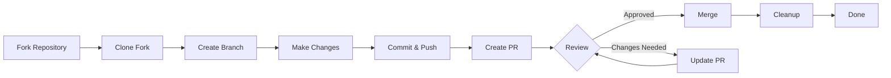

# Contribution Workflow

> This guide walks you through the complete process of contributing to XOOPS, from initial setup to merged pull request.

---

## Prerequisites

Before you start contributing, ensure you have:

- **Git** installed and configured
- **GitHub account** (free)
- **PHP 8.2+** for XOOPS development
- **Composer** for dependency management
- Basic knowledge of Git workflows
- Familiarity with [[Code-of-Conduct|Code of Conduct]]

---

## Step 1: Fork the Repository

### On GitHub Web Interface

1. Navigate to the repository (e.g., `XOOPS/XoopsCore25`)
2. Click the **Fork** button in the top-right corner
3. Select where to fork (your personal account)
4. Wait for the fork to complete

### Why Fork?

- You get your own copy to work on
- Maintainers don't need to manage many branches
- You have full control of your fork
- Pull Requests reference your fork and the upstream repo

---

## Step 2: Clone Your Fork Locally

```bash
# Clone your fork (replace YOUR_USERNAME)
git clone https://github.com/YOUR_USERNAME/XoopsCore25.git
cd XoopsCore25

# Add upstream remote to track original repository
git remote add upstream https://github.com/XOOPS/XoopsCore25.git

# Verify remotes are set correctly
git remote -v
# origin    https://github.com/YOUR_USERNAME/XoopsCore25.git (fetch)
# origin    https://github.com/YOUR_USERNAME/XoopsCore25.git (push)
# upstream  https://github.com/XOOPS/XoopsCore25.git (fetch)
# upstream  https://github.com/XOOPS/XoopsCore25.git (nofetch)
```

---

## Step 3: Set Up Development Environment

### Install Dependencies

```bash
# Install Composer dependencies
composer install

# Install development dependencies
composer install --dev

# For module development
cd modules/mymodule
composer install
```

### Configure Git

```bash
# Set your Git identity
git config user.name "Your Name"
git config user.email "your.email@example.com"

# Optional: Set global Git config
git config --global user.name "Your Name"
git config --global user.email "your.email@example.com"
```

### Run Tests

```bash
# Make sure tests pass in clean state
./vendor/bin/phpunit

# Run specific test suite
./vendor/bin/phpunit --testsuite unit
```

---

## Step 4: Create Feature Branch

### Branch Naming Convention

Follow this pattern: `<type>/<description>`

**Types:**
- `feature/` - New feature
- `fix/` - Bug fix
- `docs/` - Documentation only
- `refactor/` - Code refactoring
- `test/` - Test additions
- `chore/` - Maintenance, tooling

**Examples:**
```bash
# Feature branch
git checkout -b feature/add-two-factor-auth

# Bug fix branch
git checkout -b fix/prevent-xss-in-forms

# Documentation branch
git checkout -b docs/update-api-guide

# Always branch from upstream/main (or develop)
git checkout -b feature/my-feature upstream/main
```

### Keep Branch Up to Date

```bash
# Before you start work, sync with upstream
git fetch upstream
git merge upstream/main

# Later, if upstream has changed
git fetch upstream
git rebase upstream/main
```

---

## Step 5: Make Your Changes

### Development Practices

1. **Write code** following [[../Code-Style/PHP-Standards|PHP Standards]]
2. **Write tests** for new functionality
3. **Update documentation** if needed
4. **Run linters** and code formatters

### Code Quality Checks

```bash
# Run all tests
./vendor/bin/phpunit

# Run with coverage
./vendor/bin/phpunit --coverage-html coverage/

# Run PHP CS Fixer
./vendor/bin/php-cs-fixer fix --dry-run

# Run PHPStan static analysis
./vendor/bin/phpstan analyse class/ src/
```

### Commit Good Changes

```bash
# Check what you changed
git status
git diff

# Stage specific files
git add class/MyClass.php
git add tests/MyClassTest.php

# Or stage all changes
git add .

# Commit with descriptive message
git commit -m "feat(auth): add two-factor authentication support"
```

---

## Step 6: Keep Branch in Sync

While working on your feature, the main branch might advance:

```bash
# Fetch latest changes from upstream
git fetch upstream

# Option A: Rebase (preferred for clean history)
git rebase upstream/main

# Option B: Merge (simpler but adds merge commits)
git merge upstream/main

# If conflicts occur, resolve them then:
git add .
git rebase --continue  # or git merge --continue
```

---

## Step 7: Push to Your Fork

```bash
# Push your branch to your fork
git push origin feature/my-feature

# On subsequent pushes
git push

# If you rebased, you might need force push (use carefully!)
git push --force-with-lease origin feature/my-feature
```

---

## Step 8: Create Pull Request

### On GitHub Web Interface

1. Go to your fork on GitHub
2. You'll see a notification to create a PR from your branch
3. Click **"Compare & pull request"**
4. Or manually click **"New pull request"** and select your branch

### PR Title and Description

**Title Format:**
```
<type>(<scope>): <subject>
```

Examples:
```
feat(auth): add two-factor authentication
fix(forms): prevent XSS in text input
docs: update installation guide
refactor(core): improve performance
```

**Description Template:**

```markdown
## Description
Brief explanation of what this PR does.

## Changes
- Changed X from A to B
- Added feature Y
- Fixed bug Z

## Type of Change
- [ ] New feature (adds new functionality)
- [ ] Bug fix (fixes an issue)
- [ ] Breaking change (API/behavior change)
- [ ] Documentation update

## Testing
- [ ] Added tests for new functionality
- [ ] All existing tests pass
- [ ] Manual testing performed

## Screenshots (if applicable)
Include before/after screenshots for UI changes.

## Related Issues
Closes #123
Related to #456

## Checklist
- [ ] Code follows style guidelines
- [ ] Self-reviewed own code
- [ ] Commented complex code
- [ ] Updated documentation
- [ ] No new warnings generated
- [ ] Tests pass locally
```

### PR Review Checklist

Before submitting, ensure:

- [ ] Code follows [[../Code-Style/PHP-Standards|PHP Standards]]
- [ ] Tests are included and pass
- [ ] Documentation updated (if needed)
- [ ] No merge conflicts
- [ ] Commit messages are clear
- [ ] Related issues are referenced
- [ ] PR description is detailed
- [ ] No debug code or console logs

---

## Step 9: Respond to Feedback

### During Code Review

1. **Read comments carefully** - Understand the feedback
2. **Ask questions** - If unclear, ask for clarification
3. **Discuss alternatives** - Respectfully debate approaches
4. **Make requested changes** - Update your branch
5. **Force-push updated commits** - If rewriting history

```bash
# Make changes
git add .
git commit --amend  # Modify last commit
git push --force-with-lease origin feature/my-feature

# Or add new commits
git commit -m "Address feedback on PR review"
git push origin feature/my-feature
```

### Expect Iteration

- Most PRs require multiple review rounds
- Be patient and constructive
- View feedback as learning opportunity
- Maintainers may suggest refactors

---

## Step 10: Merge and Cleanup

### After Approval

Once maintainers approve and merge:

1. **GitHub auto-merges** or maintainer clicks merge
2. **Your branch is deleted** (usually automatic)
3. **Changes are in upstream**

### Local Cleanup

```bash
# Switch to main branch
git checkout main

# Update main with merged changes
git fetch upstream
git merge upstream/main

# Delete local feature branch
git branch -d feature/my-feature

# Delete from your fork (if not auto-deleted)
git push origin --delete feature/my-feature
```

---

## Workflow Diagram



---

## Common Scenarios

### Syncing Before Starting

```bash
# Always start fresh
git fetch upstream
git checkout -b feature/new-thing upstream/main
```

### Adding More Commits

```bash
# Just push again
git add .
git commit -m "feat: additional changes"
git push origin feature/new-thing
```

### Fixing Mistakes

```bash
# Last commit has wrong message
git commit --amend -m "Correct message"
git push --force-with-lease

# Revert to previous state (careful!)
git reset --soft HEAD~1  # Keep changes
git reset --hard HEAD~1  # Discard changes
```

### Handling Merge Conflicts

```bash
# Rebase and resolve conflicts
git fetch upstream
git rebase upstream/main

# Edit conflicted files to resolve
# Then continue
git add .
git rebase --continue
git push --force-with-lease
```

---

## Best Practices

### Do

- Keep branches focused on single issues
- Make small, logical commits
- Write descriptive commit messages
- Update your branch frequently
- Test before pushing
- Document changes
- Be responsive to feedback

### Don't

- Work directly on main/master branch
- Mix unrelated changes in one PR
- Commit generated files or node_modules
- Force push after PR is public (use --force-with-lease)
- Ignore code review feedback
- Create huge PRs (break into smaller ones)
- Commit sensitive data (API keys, passwords)

---

## Tips for Success

### Communicate

- Ask questions in issues before starting work
- Ask for guidance on complex changes
- Discuss approach in the PR description
- Respond to feedback promptly

### Follow Standards

- Review [[../Code-Style/PHP-Standards|PHP Standards]]
- Check [[Issue-Reporting|Issue Reporting]] guidelines
- Read [[../Contributing|Contributing Overview]]
- Follow [[Pull-Request-Guidelines|Pull Request Guidelines]]

### Learn the Codebase

- Read existing code patterns
- Study similar implementations
- Understand the architecture
- Check [[../../02-Core-Concepts/Core-Concepts|Core Concepts]]

---

## Related Documentation

- [[Code-of-Conduct|Code of Conduct]]
- [[Pull-Request-Guidelines|Pull Request Guidelines]]
- [[Issue-Reporting|Issue Reporting]]
- [[../Code-Style/PHP-Standards|PHP Coding Standards]]
- [[../Contributing|Contributing Overview]]

---

#xoops #git #github #contributing #workflow #pull-request
