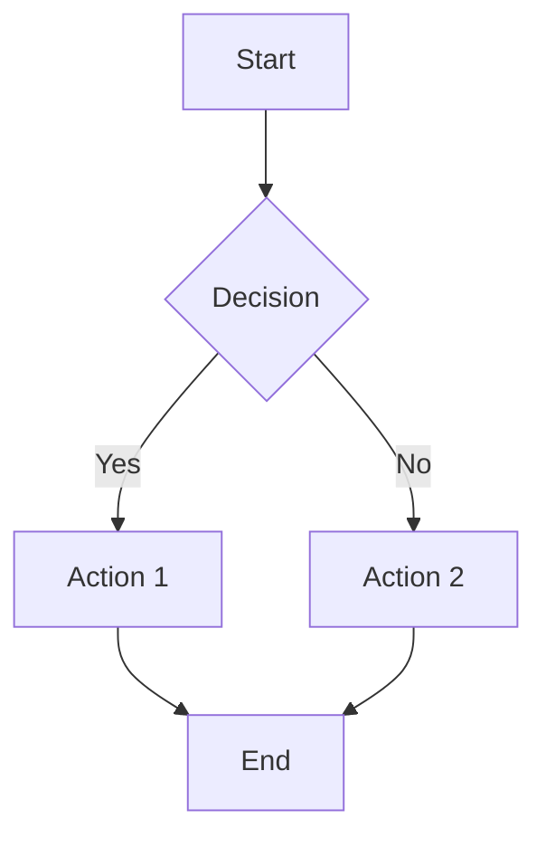
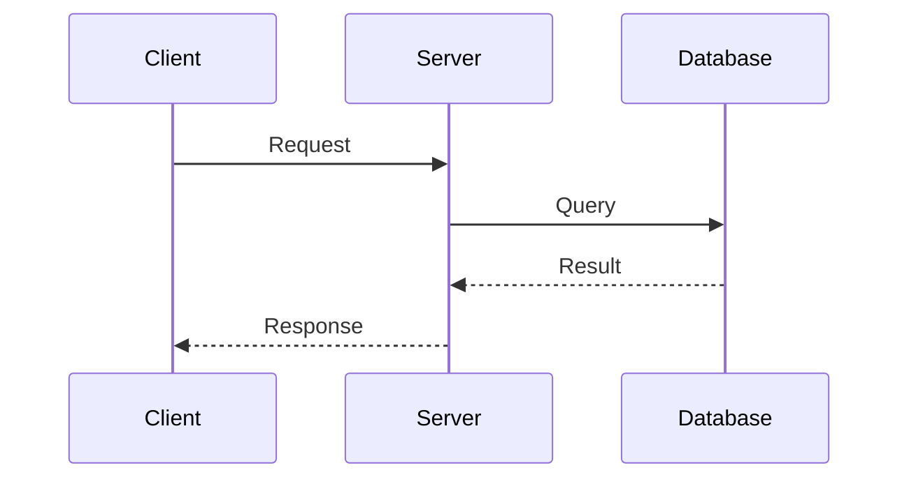
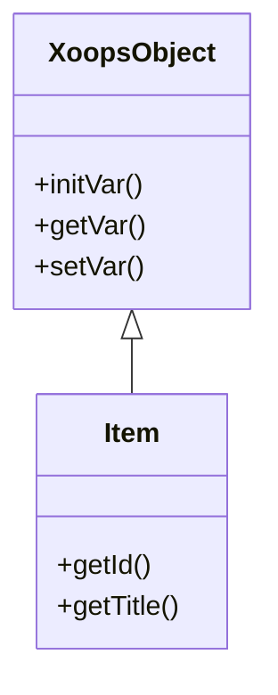
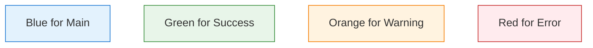

# Contributing to XOOPS Knowledge Base

Thank you for your interest in contributing to the XOOPS Knowledge Base! This guide will help you get started.

## Table of Contents

- [Getting Started](#getting-started)
- [Types of Contributions](#types-of-contributions)
- [Documentation Standards](#documentation-standards)
- [File Structure](#file-structure)
- [Writing Guidelines](#writing-guidelines)
- [Diagrams](#diagrams)
- [MkDocs Compatibility](#mkdocs-compatibility)
- [Pull Request Process](#pull-request-process)
- [Code of Conduct](#code-of-conduct)

---

## Getting Started

### Prerequisites

- [Obsidian](https://obsidian.md/) (recommended for editing)
- Git for version control
- Basic knowledge of Markdown
- Familiarity with XOOPS CMS

### Quick Setup

```bash
# Clone the repository
git clone https://github.com/XOOPS/knowledge-base.git
cd knowledge-base

# Open in Obsidian
# File → Open Vault → Select the knowledge-base folder
```

---

## Types of Contributions

We welcome the following contributions:

### 📝 Documentation Improvements
- Fix typos and grammatical errors
- Clarify confusing explanations
- Add missing information
- Update outdated content

### 📚 New Content
- Write new tutorials
- Document undocumented features
- Add code examples
- Create troubleshooting guides

### 🎨 Visual Improvements
- Add Mermaid diagrams
- Improve formatting
- Create visual guides
- Add screenshots

### 🐛 Bug Reports
- Report broken links
- Flag outdated information
- Identify missing topics

---

## Documentation Standards

### Frontmatter Template

Every markdown file must include this YAML frontmatter:

```yaml
---
title: Your Page Title
description: Brief description (50-160 characters)
created: YYYY-MM-DD
updated: YYYY-MM-DD
version: 1.0.0
category: getting-started|core-concepts|module-dev|api|troubleshooting
xoops_version: 2.5.11
status: draft|stable|deprecated
---
```

### File Naming

- Use descriptive names with spaces: `Getting Started.md`
- MOC files match folder names: `Core Concepts.md`
- Use Title Case for names

### Folder Structure

```
Section-Name/
├── Section Name.md         # Main MOC (Map of Content)
├── Subsection/
│   ├── Topic 1.md
│   └── Topic 2.md
└── Another-Subsection/
    └── Topic.md
```

---

## Writing Guidelines

### Voice and Tone

- Use active voice: "Create a file" not "A file should be created"
- Be direct and concise
- Address the reader as "you"
- Use present tense

### Structure

1. **Start with an overview** - Brief summary of what the page covers
2. **Use clear headings** - Logical hierarchy (H2, H3, H4)
3. **Include examples** - Code snippets with explanations
4. **Add related links** - Connect to related documentation

### Code Examples

Always include complete, runnable examples:

```php
<?php
// ✅ Good - Complete and clear
use Xmf\Request;

$id = Request::getInt('id', 0);
if ($id > 0) {
    $handler = $helper->getHandler('Item');
    $item = $handler->get($id);
}
```

```php
<?php
// ❌ Bad - Incomplete or unclear
$id = Request::getInt('id', 0);
// ... do something with $id
```

### Internal Links

Use **standard markdown links** for all internal references. This ensures compatibility with both Obsidian and MkDocs:

```markdown
<!-- ✅ Correct - Standard markdown links -->
See [Core Concepts](02-Core-Concepts/Core-Concepts.md) for more details.
Read about [the XoopsObject class](04-API-Reference/Core/XoopsObject.md).

<!-- ❌ Avoid - Wikilinks (Obsidian-only) -->
See [[02-Core-Concepts/Core-Concepts]] for more details.
[[04-API-Reference/Core/XoopsObject|the XoopsObject class]]
```

**Why?** The documentation is published via MkDocs, which doesn't support Obsidian wikilinks. Standard markdown links work in both environments.

### Tags

End each file with relevant tags:

```markdown
#xoops #module-development #tutorial #beginner
```

Common tags:
- `#xoops` - Always include
- Skill level: `#beginner`, `#intermediate`, `#advanced`
- Type: `#tutorial`, `#reference`, `#troubleshooting`
- Topic: `#forms`, `#database`, `#templates`

---

## Diagrams

We use [Mermaid](https://mermaid.js.org/) for all diagrams. Here are the standard patterns:

### Flowchart



### Sequence Diagram



### Class Diagram



### Styling Guidelines

Use consistent colors for diagram elements:



---

## MkDocs Compatibility

This documentation is published using [MkDocs Material](https://squidfunk.github.io/mkdocs-material/). When contributing, use syntax that works in both Obsidian and MkDocs.

### Admonitions (Callouts)

Use **MkDocs admonition syntax**, not Obsidian callouts:

```markdown
<!-- ✅ Correct - MkDocs admonition syntax -->
!!! tip "Pro Tip"
    This is the content of the admonition.
    Use 4-space indentation for content.

!!! warning "Important"
    Multiple lines are supported.

    Even blank lines within the block.

<!-- ❌ Avoid - Obsidian callout syntax -->
> [!tip] Pro Tip
> This only works in Obsidian, not MkDocs.
```

**Available admonition types:**

| Type | Usage |
|------|-------|
| `note` | General information |
| `tip` | Helpful suggestions |
| `info` | Contextual information |
| `warning` | Cautions and potential issues |
| `danger` | Critical warnings |
| `example` | Code or usage examples |
| `abstract` | Summaries or TL;DR |
| `question` | FAQs or clarifications |
| `success` | Positive outcomes |
| `failure` | Error conditions |

### Version Badges

Use HTML span elements with CSS classes for version indicators:

```html
<span class="version-badge version-25x">2.5.x ✅</span>
<span class="version-badge version-40x">4.0 ✅</span>
<span class="version-badge version-xmf">XMF Required</span>
<span class="version-badge version-deprecated">Deprecated</span>
```

These badges help readers quickly identify which XOOPS version a feature applies to.

### Tables with Links

When using links inside markdown tables, always use standard markdown format:

```markdown
<!-- ✅ Correct -->
| Pattern | Documentation |
|---------|---------------|
| Repository | [Repository Pattern](Patterns/Repository-Pattern.md) |

<!-- ❌ Will break in MkDocs -->
| Pattern | Documentation |
|---------|---------------|
| Repository | [[Patterns/Repository-Pattern|Repository Pattern]] |
```

---

## Pull Request Process

### 1. Create a Branch

```bash
git checkout -b docs/your-feature-name
```

Branch naming conventions:
- `docs/add-xyz` - New documentation
- `docs/fix-xyz` - Corrections
- `docs/update-xyz` - Updates to existing content

### 2. Make Your Changes

- Edit files in Obsidian or your preferred editor
- Preview changes locally
- Ensure all links work
- Check diagrams render correctly

### 3. Commit Your Changes

```bash
git add .
git commit -m "docs: Add tutorial for XMF Request handling"
```

Commit message prefixes:
- `docs:` - Documentation changes
- `fix:` - Bug fixes (broken links, typos)
- `chore:` - Maintenance tasks

### 4. Submit Pull Request

1. Push your branch: `git push origin docs/your-feature-name`
2. Open a Pull Request on GitHub
3. Fill in the PR template
4. Wait for review

### PR Checklist

Before submitting, verify:

- [ ] Frontmatter is complete and accurate
- [ ] All internal links work (use standard markdown, not wikilinks)
- [ ] Admonitions use MkDocs syntax (`!!! type` not `> [!type]`)
- [ ] Code examples are tested
- [ ] Diagrams render correctly
- [ ] Spelling and grammar checked
- [ ] No duplicate content
- [ ] Related pages updated if needed

---

## Review Process

### What We Check

1. **Accuracy** - Information is correct and current
2. **Clarity** - Easy to understand
3. **Completeness** - All necessary information included
4. **Consistency** - Follows established patterns
5. **Links** - All references work

### Response Time

We aim to review PRs within:
- Simple fixes: 1-2 days
- New content: 3-5 days
- Major additions: 1 week

---

## Need Help?

### Getting Support

- Open an issue for questions
- Join the XOOPS community forums
- Check existing documentation

### Resources

- [XOOPS Community](https://xoops.org)
- [GitHub Repository](https://github.com/XOOPS)
- [Mermaid Documentation](https://mermaid.js.org/intro/)
- [Obsidian Help](https://help.obsidian.md/)

---

## Code of Conduct

### Our Standards

- Be respectful and inclusive
- Welcome newcomers
- Focus on constructive feedback
- Assume good intentions

### Unacceptable Behavior

- Harassment or discrimination
- Personal attacks
- Off-topic discussions
- Spam or self-promotion

---

## Recognition

Contributors will be:
- Listed in the repository's contributors
- Thanked in release notes for significant contributions
- Acknowledged in the documentation where appropriate

---

Thank you for helping make XOOPS documentation better for everyone! 🎉
